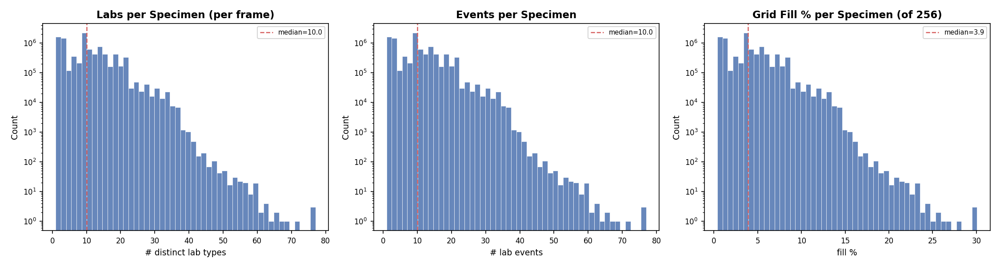
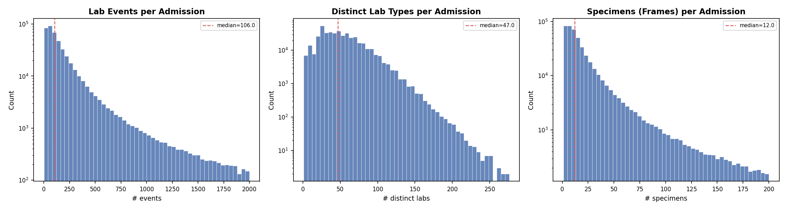
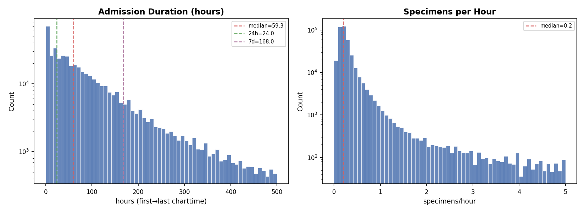
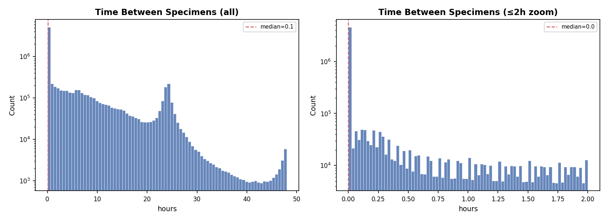
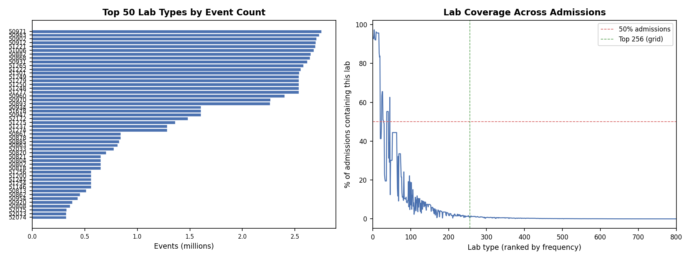
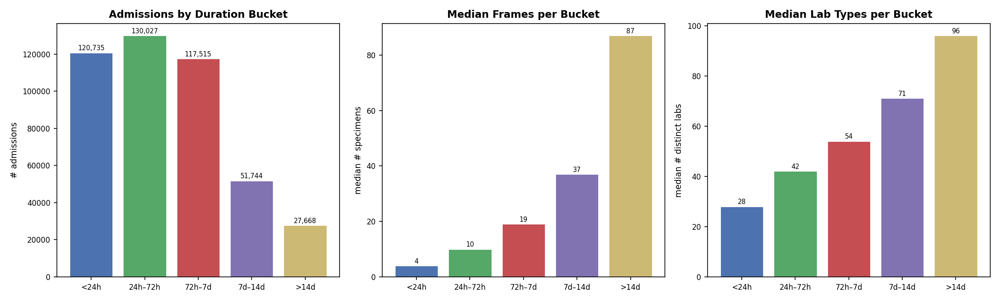
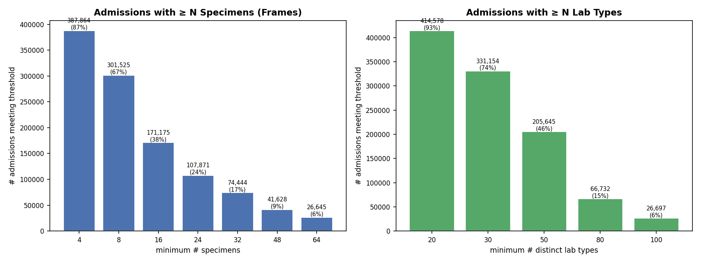

# MIMIC-IV Lab Events Data Analysis Report

**Project:** Latte — VideoMAE-style modeling of ICU lab time series  
**Dataset:** MIMIC-IV `lab_events_with_adm.parquet` (lab events joined with admissions, hadm_id backfilled 0–24 h before admission)  
**Date:** February 2026  
**Script:** `scripts/admission_stats.py`, `scripts/admission_plots.py`

---

## Table of Contents

1. [Executive Summary](#1-executive-summary)
2. [Dataset-Level Totals](#2-dataset-level-totals)
3. [Per-Specimen Distributions (Per Frame / Per Image)](#3-per-specimen-distributions)
4. [Per-Admission Distributions (Per Video)](#4-per-admission-distributions)
5. [Temporal Analysis](#5-temporal-analysis)
6. [Lab Frequency and Coverage](#6-lab-frequency-and-coverage)
7. [Duration-Bucket Breakdown](#7-duration-bucket-breakdown)
8. [Feasibility Analysis: Subset Thresholds](#8-feasibility-analysis)
9. [Key Findings and Implications](#9-key-findings-and-implications)
10. [Roadmap: From Analysis to VideoMAE Training](#10-roadmap)

---

## 1. Executive Summary

This report characterizes the distribution of lab events across admissions in the MIMIC-IV dataset, viewed through the lens of our VideoMAE pipeline where:

- **One video = one admission** (or one time window of an admission)
- **One frame = one specimen** (a set of lab tests drawn at the same time)
- **One pixel = one lab type** in a 16×16 grid, with value = the real lab measurement

We analyze the data at three levels: **dataset totals**, **per-specimen** (per frame), and **per-admission** (per video). The analysis reveals a dataset with high sparsity at the frame level (~4% grid fill), highly variable video lengths (median 12 frames), and right-skewed distributions across all metrics. These findings inform our design choices for time binning, minimum admission criteria, and the overall training strategy.

---

## 2. Dataset-Level Totals

| Metric | Value | Notes |
|--------|-------|-------|
| Total lab events | 158,374,764 | All rows in `lab_events_with_adm.parquet` |
| Total admissions | 447,689 | Distinct `hadm_id` values |
| Total specimens | 17,503,481 | Distinct `specimen_id` values |
| `hadm_id` null | 68,057,184 (43.0%) | Outpatient / unlinked events |
| `valuenum` null | 21,490,341 (13.6%) | Text-only results (no numeric value) |

**Key takeaway:** 43% of lab events cannot be linked to a hospital admission — these are outpatient or pre-registration events. After filtering to admission-linked events, we work with ~90M events across ~448K admissions. The 13.6% null `valuenum` rate means some lab types produce qualitative (text) results rather than numeric values; these will appear as missing (zero) in the grid.

---

## 3. Per-Specimen Distributions

Each specimen corresponds to **one frame** (one image) in our video representation — a single blood draw or lab collection at one timepoint.

| Metric | Mean | Median | p5 | p25 | p75 | p95 | Min | Max |
|--------|------|--------|-----|-----|-----|-----|-----|-----|
| **Labs / specimen** (distinct lab types per frame) | 9.37 | 10 | 1 | 3 | 14 | 21 | 1 | 77 |
| **Events / specimen** (total values per frame) | 9.37 | 10 | 1 | 3 | 14 | 21 | 1 | 77 |
| **Grid fill %** (of 256 cells) | 3.66% | 3.91% | 0.39% | 1.17% | 5.47% | 8.20% | 0.39% | 30.08% |



**Key observations:**

- **n_labs = n_events per specimen:** These are identical, confirming that **within a single specimen, each lab type appears exactly once**. This simplifies grid construction — no need to aggregate duplicate lab types within a frame.
- **Extreme sparsity:** The median frame fills only ~4% of the 256-cell grid (10 out of 256 labs). Even at p95, only 21 labs are present (~8% fill). This means the vast majority of each frame is empty/zero.
- **Implication for VideoMAE:** The high sparsity is both a challenge and an opportunity. VideoMAE's random masking (90–95%) applied on top of already-sparse data means the model sees very few actual values. Strategies to address this include: (a) using a smaller grid (e.g., top-64 labs in an 8×8 grid), (b) using dense lab subsets, or (c) treating sparsity as part of the signal the model must learn.

---

## 4. Per-Admission Distributions

Each admission corresponds to **one video** — a sequence of frames (specimens) over the hospital stay.

| Metric | Mean | Median | p5 | p25 | p75 | p95 | Min | Max |
|--------|------|--------|-----|-----|-----|-----|-----|-----|
| **Events / admission** | 201.7 | 106 | 15 | 52 | 215 | 664 | 1 | 21,655 |
| **Labs / admission** (distinct types) | 50.97 | 47 | 12 | 29 | 67 | 103 | 1 | 276 |
| **Specimens / admission** (frames) | 21.54 | 12 | 2 | 6 | 23 | 71 | 1 | 2,495 |



| Metric | Mean | Median | p5 | p25 | p75 | p95 | Min | Max |
|--------|------|--------|-----|-----|-----|-----|-----|-----|
| **Hours / admission** (duration) | 109.4 | 59.3 | 0 | 22.4 | 129.6 | 379.0 | 0 | 12,367 |
| **Specimens / hour** (sampling freq) | 0.74 | 0.20 | 0.09 | 0.15 | 0.30 | 0.84 | ~0 | 600 |



**Key observations:**

- **Short videos dominate:** The median admission has only **12 specimens (frames)**. 75% have ≤23 frames. This is well within the typical VideoMAE range of 16–32 frames, but many admissions are even shorter.
- **Right-skewed duration:** The median stay spans ~59 hours (≈2.5 days), but the mean is ~109 hours due to a long tail extending beyond 2 weeks.
- **Low sampling frequency:** The median specimen is collected every ~5 hours (0.20 specimens/hour). This is important for time-binning: with 1-hour bins and only 0.2 specimens/hour on average, most hourly bins will be empty.
- **Lab diversity per admission:** The median admission uses 47 distinct lab types out of 256 in the grid — about 18% of the grid is used at least once across the entire stay. This is much better than the per-frame fill, suggesting temporal aggregation helps significantly.

---

## 5. Temporal Analysis

### 5.1 Time Gaps Between Consecutive Specimens

| Metric | Mean | Median | p5 | p25 | p75 | p95 | Max |
|--------|------|--------|-----|-----|-----|-----|-----|
| **Hours between specimens** | 5.33 | 0.07 (4 min) | 0.00 | 0.00 | 7.20 | 24.08 | 2,548 |



**Key observations:**

- **Bimodal gap structure:** The median gap is only 4 minutes, reflecting that many specimens within an admission are drawn **simultaneously** (same blood draw → multiple tubes → multiple specimen IDs). However, the p75 jumps to 7.2 hours — the gap between different rounds of lab draws.
- **Clinical pattern:** Labs are typically ordered in batches (e.g., morning labs, post-procedure labs). Within a batch, multiple specimens are collected at once (gap ≈ 0 min). Between batches, the gap is several hours.
- **Implication for time binning:** If we use 1-hour bins, most bins will have either 0 or multiple specimens (from the same batch). This supports an aggregation strategy (e.g., "last value" or "mean" per lab type per bin) rather than one-specimen-per-bin.

---

## 6. Lab Frequency and Coverage



**Key observations:**

- **Steep frequency dropoff:** A small number of lab types (CBC, BMP, etc.) dominate the event counts, while many lab types are rare. The top 50 labs account for a large fraction of all events.
- **Coverage curve:** The plot shows what percentage of admissions contain each lab type (ranked by frequency). The top ~30 labs appear in >50% of admissions. By rank 256 (our grid size), coverage drops significantly.
- **Implication for grid design:** The current 16×16 = 256 lab grid includes many labs that appear in a small fraction of admissions. A smaller, denser grid (e.g., top-64 or top-128 labs) would increase the per-frame fill rate substantially. However, a larger grid preserves more clinical information. This is a tunable hyperparameter.

---

## 7. Duration-Bucket Breakdown

We segment admissions by stay duration to understand how video characteristics vary with length of stay.



| Bucket | # Admissions | Median Frames | Median Lab Types |
|--------|-------------|---------------|-----------------|
| <24h | 105,831 | 5 | 30 |
| 24h–72h | 133,165 | 10 | 44 |
| 72h–7d | 131,416 | 20 | 58 |
| 7d–14d | 46,529 | 45 | 79 |
| >14d | 30,748 | 106 | 100 |

**Key observations:**

- **Short stays are common:** ~24% of admissions are <24h. These have a median of only 5 frames and 30 lab types — very sparse videos.
- **Sweet spot:** The 24h–7d range (264K admissions, 59% of total) offers a good balance: 10–20 median frames, 44–58 lab types.
- **Long stays are data-rich but rare:** Stays >7d have excellent lab coverage (79–100 median lab types) and many frames (45–106), but represent only 17% of admissions.
- **Implication:** For Phase 1 (proof of concept), filtering to admissions with 24h–7d duration provides the best data density-to-volume tradeoff.

---

## 8. Feasibility Analysis

How many admissions survive various minimum-threshold filters?



### Minimum Specimens (Frames) Thresholds

| Min Specimens | # Admissions | % of Total |
|--------------|-------------|------------|
| ≥4 | ~354K | ~79% |
| ≥8 | ~268K | ~60% |
| ≥16 | ~168K | ~38% |
| ≥24 | ~110K | ~25% |
| ≥32 | ~82K | ~18% |
| ≥48 | ~50K | ~11% |
| ≥64 | ~33K | ~7% |

### Minimum Lab Types Thresholds

| Min Lab Types | # Admissions | % of Total |
|--------------|-------------|------------|
| ≥20 | ~378K | ~84% |
| ≥30 | ~313K | ~70% |
| ≥50 | ~196K | ~44% |
| ≥80 | ~63K | ~14% |
| ≥100 | ~27K | ~6% |

**Practical subset for Phase 1:** Requiring `n_specimens ≥ 16` AND `n_labs ≥ 30` gives approximately **140K–168K admissions** — a large, well-populated training set with enough frames for meaningful temporal learning and enough lab diversity to fill a reasonable portion of the grid.

---

## 9. Key Findings and Implications

### 9.1 Sparsity is the Dominant Challenge

- Per-frame fill is only ~4% of the 256-cell grid.
- Even per-admission, only ~18% of grid cells are ever filled.
- **Design response:** Consider a smaller grid (top-64 labs, 8×8) for higher density, or keep 256 but acknowledge that masking ratio for VideoMAE should account for inherent sparsity.

### 9.2 Specimens ≠ Time Bins

- Specimens cluster at the same timestamp (multiple tubes per blood draw). Median inter-specimen gap is 4 minutes.
- **Design response:** Time-bin aggregation (e.g., 1-hour or 2-hour bins, "last value per lab per bin") is essential. Raw specimen-per-frame would create many near-duplicate frames.

### 9.3 Lab Duplication is Not an Issue Within Specimens

- `n_labs/specimen == n_events/specimen` exactly. Each lab type appears at most once per specimen.
- **Design response:** No deduplication logic needed when building frames from specimens.

### 9.4 Most Videos Are Short

- Median: 12 frames; 75th percentile: 23 frames.
- **Design response:** With 1-hour bins over 24h → 24 frames, most admissions will fill only a fraction of bins. Padding + attention masking is critical for the model.

### 9.5 Long-Tail Distribution Across All Metrics

- All metrics (events, labs, specimens, duration) are heavily right-skewed.
- **Design response:** Use percentile-based thresholds for subsetting, not mean-based. Report median and IQR rather than mean ± std.

---

## 10. Roadmap

Based on this analysis, here is the implementation roadmap from current state to a trainable VideoMAE dataset:

### Phase 0: Data Analysis (Current — DONE)
- [x] Build `lab_events_with_adm.parquet` (admission-aware, hadm_id backfilled)
- [x] Compute dataset-level, per-specimen, per-admission statistics
- [x] Generate distribution plots and this report
- [x] Identify feasible admission subsets

### Phase 1: Admission → Video Conversion (Next)

| Step | Description | Status |
|------|-------------|--------|
| **1.1** Define time-bin schema | Choose window (e.g., first 24h), bin size (1h), → T=24 frames. Anchor to `admittime`. | To do |
| **1.2** Build `admission_to_video.py` | For each admission: assign lab events to time bins, aggregate (last value per lab per bin), build T×H×W tensor, save as `.npy`. | To do |
| **1.3** Grid size decision | Keep 16×16 (256 labs, ~4% fill per frame) or switch to 8×8 (64 labs, ~15% fill per frame). Both should be configurable. | To decide |
| **1.4** Normalization strategy | Per-lab z-score (using train-set statistics), ref-range normalization, or quantile scaling. | To decide |

### Phase 2: Admission Filtering & Subset Definition

| Step | Description | Status |
|------|-------------|--------|
| **2.1** Define minimum criteria | e.g., `n_specimens ≥ 16`, `n_labs ≥ 30`, `duration ≥ 12h`. | To decide |
| **2.2** Compute lab completeness | For each admission over the 24h×K grid, compute fill ratio. Filter to ≥60–70% completeness. | To do |
| **2.3** Build admission list | Output a filtered `hadm_id` list for downstream processing. | To do |

### Phase 3: Training Data Pipeline

| Step | Description | Status |
|------|-------------|--------|
| **3.1** Sliding windows | For stays >24h, emit multiple 24h windows (0–24h, 12–36h, ...) as separate samples. | To do |
| **3.2** Output format | Save as individual `.npy` (T, H, W) or batched HDF5/TFRecord. Include observation masks. | To do |
| **3.3** Train/val/test split | Split by `subject_id` (not `hadm_id`) to avoid data leakage. | To do |
| **3.4** DataLoader | PyTorch Dataset/DataLoader for VideoMAE, with padding and attention masks. | To do |

### Phase 4: VideoMAE Pre-training

| Step | Description | Status |
|------|-------------|--------|
| **4.1** Adapt VideoMAE architecture | Single-channel input (lab value), appropriate patch size for 16×16 or 8×8 spatial. | To do |
| **4.2** Masking strategy | Tune masking ratio considering inherent sparsity (~96% zeros per frame). | To do |
| **4.3** Pre-training run | Self-supervised pre-training on masked video reconstruction. | To do |

### Phase 5: Downstream Tasks & Evaluation

| Step | Description | Status |
|------|-------------|--------|
| **5.1** Task definition | In-hospital mortality, length-of-stay, readmission, phenotyping. | To decide |
| **5.2** Fine-tuning | Fine-tune pre-trained VideoMAE on labeled tasks. | To do |
| **5.3** Cross-dataset validation | Harmonize with eICU; train on MIMIC, test on eICU (and vice versa). | Future |

---

### Immediate Next Steps

1. **Decide grid size**: 16×16 vs 8×8 (run `admission_stats.py` with top-64 itemids to compare fill rates).
2. **Implement `admission_to_video.py`**: Time-bin assignment + T×H×W tensor construction.
3. **Choose admission filters**: Apply thresholds from Section 8 to define the Phase 1 training set.

---

## Appendix: Reproducing This Report

```bash
# Generate summary statistics (printed to stdout)
python scripts/admission_stats.py

# Generate all distribution plots (saved to docs/figures/)
python scripts/admission_plots.py

# List top admissions by lab event count
python scripts/top_admissions.py --top 100
```

All scripts read from `MIMIC4/lab_events_with_adm.parquet` by default. See `scripts/README.md` for full usage.
