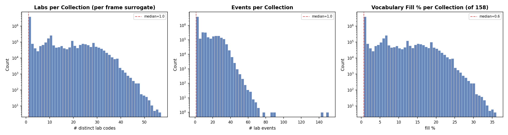
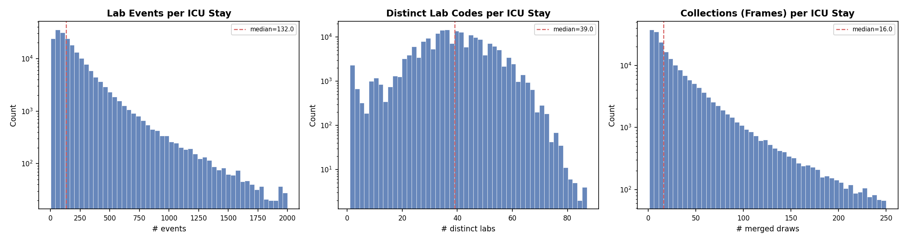
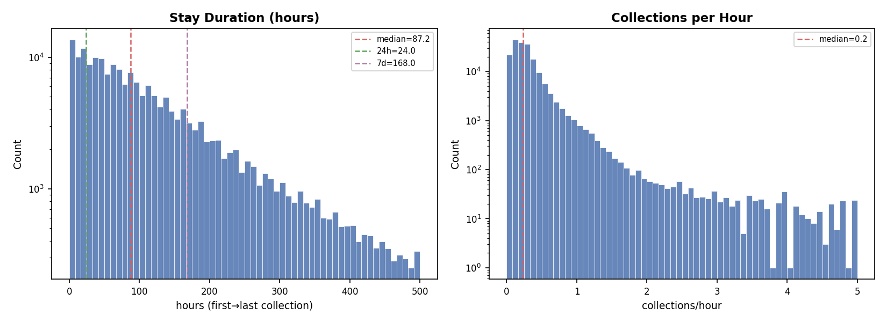
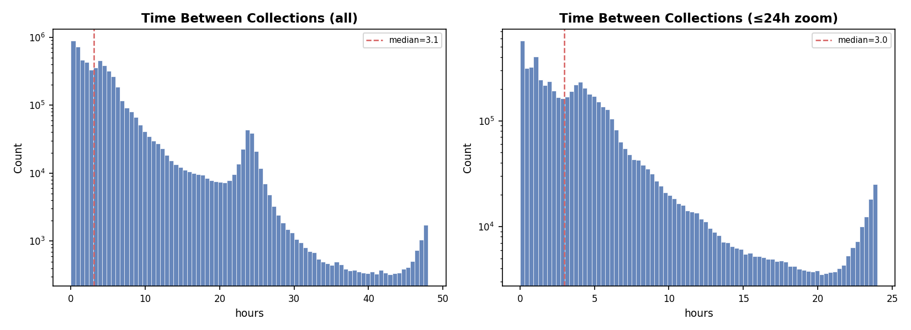
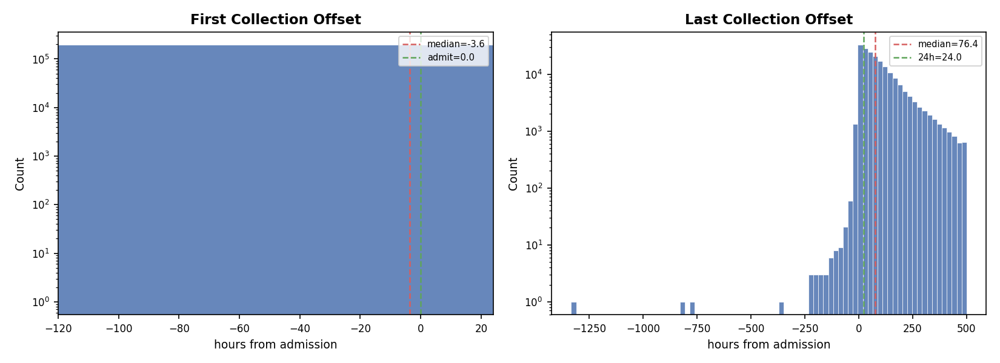
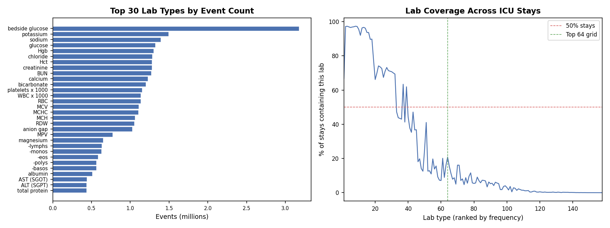
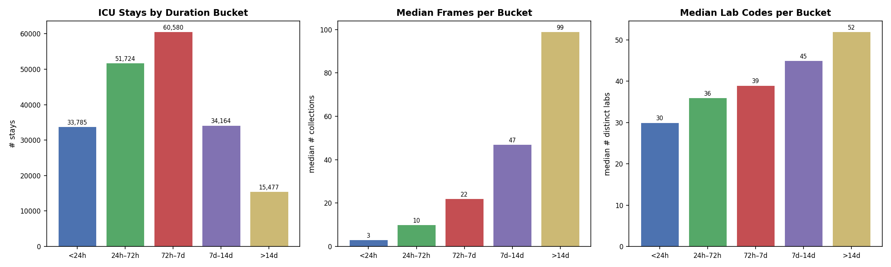
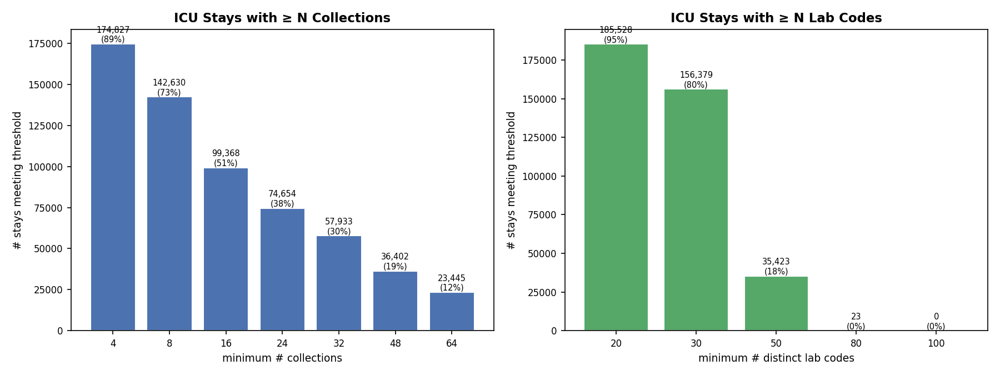

# eICU Lab Events Data Analysis Report

**Project:** Latte — VideoMAE-style modeling of ICU lab time series  
**Dataset:** eICU `lab_events_with_adm.parquet` (lab table joined to patient/unit stays; collection surrogate = `labresultoffset`)  
**Date:** March 22, 2026  
**Scripts:** `scripts/eicu/admission_stats.py`, `scripts/eicu/admission_plots.py`

---

## Table of Contents

1. [Executive Summary](#1-executive-summary)
2. [Dataset-Level Totals](#2-dataset-level-totals)
3. [Per-Collection Distributions (Per Frame Surrogate)](#3-per-collection-distributions-per-frame-surrogate)
4. [Per-Stay Distributions (Per Video Candidate)](#4-per-stay-distributions-per-video-candidate)
5. [Temporal Analysis](#5-temporal-analysis)
6. [Lab Frequency and Coverage](#6-lab-frequency-and-coverage)
7. [Duration-Bucket Breakdown](#7-duration-bucket-breakdown)
8. [Feasibility Analysis](#8-feasibility-analysis)
9. [Key Findings and Implications](#9-key-findings-and-implications)
10. [Roadmap: From Analysis to VideoMAE Training](#10-roadmap-from-analysis-to-videomae-training)

---

## 1. Executive Summary

This report mirrors the MIMIC-IV analysis in `DATA_ANALYSIS_REPORT.md`, but applies it to the local eICU extract. The core representation is:

- **One video = one ICU stay** (`patientunitstayid`)
- **One frame = one merged collection timepoint**
- **One pixel = one lab type** in the downstream grid (currently top-64 labs, 8×8)

The main eICU-specific differences are structural:

- There is **no native `specimen_id`**, so we merge rows by **minute offset from admission** (`labresultoffset`) within each ICU stay.
- A large fraction of rows occur **before the reconstructed admission anchor**: **18.8% of events** and **74.0% of stays** have negative offsets.
- Stay-level lab density is strong overall (median **16 collections** and **39 distinct lab codes** per stay), but the **first 24 hours are much sparser** (median **5 collections**), which materially constrains a fixed 24-frame setup.

Compared with MIMIC-IV, eICU has a smaller observed lab vocabulary (**158 codes**) and stronger concentration in a small core of routine labs. The top 20 lab codes account for **65.8%** of all events, and **34 lab codes** appear in more than half of ICU stays.

---

## 2. Dataset-Level Totals

| Metric | Value | Notes |
|--------|-------|-------|
| Total lab events | 39,132,531 | All rows in `eICU/lab_events_with_adm.parquet` |
| Total ICU stays | 195,730 | Distinct `patientunitstayid` values |
| Total merged collections | 5,925,386 | Distinct `(patientunitstayid, labresultoffset)` pairs |
| Distinct lab codes | 158 | Rank-encoded from distinct `labname` values |
| Distinct patients | 138,249 | Distinct `uniquepid` values |
| `patientunitstayid` null | 0 (0.0%) | Stay linkage is complete in this extract |
| `labresult` null | 229,518 (0.6%) | Mostly text-only / non-numeric rows |
| Negative `labresultoffset` | 7,340,524 (18.8%) | Pre-admission relative to the reconstructed anchor |
| Stays with any negative `labresultoffset` | 144,841 (74.0%) | Pre-admission labs are the norm, not an edge case |

**Key takeaway:** Unlike MIMIC-IV, the eICU extract is fully stay-linked, but its timing is much noisier around admission. Any training pipeline that uses the first 24 hours must explicitly filter to `labresultoffset ∈ [0, 24h)` rather than assuming the raw stay timeline is already aligned.

---

## 3. Per-Collection Distributions (Per Frame Surrogate)

Because eICU lacks a native specimen identifier, each “frame” is approximated as **all labs recorded in the same minute offset** within a stay.

| Metric | Mean | Median | p5 | p25 | p75 | p95 | Min | Max |
|--------|------|--------|-----|-----|-----|-----|-----|-----|
| **Labs / collection** (distinct codes per merged draw) | 6.58 | 1 | 1 | 1 | 10 | 28 | 1 | 57 |
| **Events / collection** (total rows per merged draw) | 6.60 | 1 | 1 | 1 | 10 | 28 | 1 | 151 |
| **Vocabulary fill %** (of 158 observed codes) | 4.17% | 0.63% | 0.63% | 0.63% | 6.33% | 17.72% | 0.63% | 36.08% |

**Key observations:**

- **Most collections are single-lab events:** The median merged collection contains only **1 lab code**. This is much sparser than MIMIC’s specimen abstraction.
- **Duplicate lab codes within a collection are rare but non-zero:** `n_events > n_labs` in only **35,256 / 5,925,386 collections (0.6%)**. Grouping by minute offset occasionally collapses repeated measurements of the same lab.
- **The raw 158-code vocabulary is very sparse per frame:** Median fill is only **0.63%**.
- **The planned 8×8 top-64 grid is denser than the raw vocabulary view:** when restricted to the top 64 lab codes, the average collection contains **6.44** grid labs (**10.1% fill**), though the median is still just **1 / 64 = 1.56%**.

**Implication for VideoMAE:** eICU frames are sparse even after moving to a top-64 grid. The model will need to rely heavily on temporal context rather than dense within-frame structure.

---

## 4. Per-Stay Distributions (Per Video Candidate)

Each ICU stay is a candidate video: a sequence of merged collection frames over the stay.

| Metric | Mean | Median | p5 | p25 | p75 | p95 | Min | Max |
|--------|------|--------|-----|-----|-----|-----|-----|-----|
| **Events / stay** | 199.93 | 132 | 24 | 69 | 244 | 595 | 1 | 8,213 |
| **Labs / stay** (distinct codes) | 38.56 | 39 | 19 | 31 | 47 | 58 | 1 | 87 |
| **Collections / stay** (frames) | 30.27 | 16 | 2 | 7 | 37 | 102 | 1 | 2,663 |

| Metric | Mean | Median | p5 | p25 | p75 | p95 | Min | Max |
|--------|------|--------|-----|-----|-----|-----|-----|-----|
| **Hours / stay** (first→last collection span) | 149.72 | 87.18 | 4.25 | 37.50 | 169.58 | 412.09 | 0 | 876,660.33 |
| **Collections / hour** (sampling frequency) | 0.46 | 0.23 | 0.06 | 0.13 | 0.34 | 0.75 | ~0 | 120 |

**Key observations:**

- **Videos are moderately long overall:** The median stay has **16 collections**, and 75% have **≤37**. This is compatible with 16–32 frame encoders if we subset or bin.
- **Lab diversity is decent at the stay level:** The median stay contains **39 distinct lab codes** out of 158 observed, and **36** out of the downstream top-64 grid.
- **Sampling is fairly slow:** The median sampling rate is **0.23 collections/hour**, or roughly one collection every **4.3 hours**.
- **The maximum duration is not clinically meaningful:** The huge right tail (`876,660` h) is driven by timestamp reconstruction artifacts in a small number of stays. Percentiles are more reliable than maxima here.

---

## 5. Temporal Analysis

### 5.1 Time Gaps Between Consecutive Collections

| Metric | Mean | Median | p5 | p25 | p75 | p95 | Max |
|--------|------|--------|-----|-----|-----|-----|-----|
| **Hours between collections** | 5.11 | 3.07 | 0.10 | 1.07 | 5.32 | 16.40 | 876,306.32 |

**Key observations:**

- **Gaps are measured in hours, not minutes:** Unlike MIMIC specimens, eICU merged collections are not dominated by same-timestamp batched draws. The median gap is **3.07 hours**.
- **1-hour bins will often be empty:** With a median of 0.23 collections/hour, many hourly bins will contain no observations.
- **The extreme max gap is an outlier artifact:** The right tail again reflects reconstructed-anchor issues rather than true year-scale ICU stays.

### 5.2 Offset Relative to Admission

| Metric | Mean | Median | p5 | p25 | p75 | p95 | Min | Max |
|--------|------|--------|-----|-----|-----|-----|-----|-----|
| **First collection offset / stay** (hours from admission) | -31.68 | -3.58 | -89.50 | -7.90 | 0.07 | 7.28 | -876,307.73 | 6,412.93 |
| **Last collection offset / stay** (hours from admission) | 118.04 | 76.40 | 3.00 | 31.54 | 150.32 | 369.75 | -1,332.60 | 13,843.05 |

**Key observations:**

- **Pre-admission labs are common:** The median first collection occurs **3.6 hours before** the reconstructed admission time.
- **Only 26.0% of stays have a non-negative first collection offset.**
- **Most stays still have post-admission data:** **189,302 / 195,730 stays (96.7%)** contain at least one collection in the first 24 hours after admission.

**Implication for time-binning:** The correct eICU observation window is not “first 24 raw frames”; it is **`labresultoffset` in `[0, 24h)`**, followed by aggregation within hourly bins.

---

## 6. Lab Frequency and Coverage

**Key observations:**

- **A small core vocabulary dominates the dataset:** The top 20 lab codes account for **65.8%** of all lab events.
- **Routine chemistry and CBC labs dominate:** the most frequent codes are **bedside glucose, potassium, sodium, glucose, Hgb, chloride, Hct, creatinine, BUN, and calcium**.
- **Coverage decays more slowly than in MIMIC:** **34 lab codes** appear in **>50%** of stays, and **18** appear in **>75%** of stays.
- **The top-64 grid is reasonable for eICU:** the 64th-most-common lab still appears in **20.8%** of stays, so an 8×8 grid captures a substantial share of clinically routine measurements without wasting many cells on ultra-rare codes.

**Implication for grid design:** eICU does not need a 16×16 grid. A top-64 layout is aligned with both the observed vocabulary size and the long-tailed frequency curve.

---

## 7. Duration-Bucket Breakdown

We segment stays by the raw first→last collection span to understand how video richness changes with length of stay.

| Bucket | # Stays | Median Frames | Median Lab Codes |
|--------|--------:|--------------:|-----------------:|
| <24h | 33,785 | 3 | 30 |
| 24h–72h | 51,724 | 10 | 36 |
| 72h–7d | 60,580 | 22 | 39 |
| 7d–14d | 34,164 | 47 | 45 |
| >14d | 15,477 | 99 | 52 |

**Key observations:**

- **Very short stays are common but weak for sequence learning:** The `<24h` bucket has a median of only **3 frames**.
- **The 24h–7d range is the practical middle:** **112,304 stays** fall in the **24h–7d** range and have median frame counts from **10 to 22**.
- **Long stays are rich but much rarer:** Stays beyond 7 days are excellent from a density perspective, but they make up only **49,641 stays (25.4%)**.

**Caveat:** These buckets reflect raw observed span, which is affected by negative offsets and anchor reconstruction. They are still useful descriptively, but the first-24h benchmark window should be defined independently from these spans.

---

## 8. Feasibility Analysis

### 8.1 Full-Stay Thresholds

#### Minimum Collections (Frames) Thresholds

| Min Collections | # Stays | % of Total |
|----------------|--------:|-----------:|
| ≥4 | 174,827 | 89.3% |
| ≥8 | 142,630 | 72.9% |
| ≥16 | 99,368 | 50.8% |
| ≥24 | 74,654 | 38.1% |
| ≥32 | 57,933 | 29.6% |
| ≥48 | 36,402 | 18.6% |
| ≥64 | 23,445 | 12.0% |

#### Minimum Lab-Code Thresholds

| Min Lab Codes | # Stays | % of Total |
|--------------|--------:|-----------:|
| ≥20 | 185,528 | 94.8% |
| ≥30 | 156,379 | 79.9% |
| ≥50 | 35,423 | 18.1% |
| ≥80 | 23 | ~0.0% |
| ≥100 | 0 | 0.0% |

**Practical full-stay subset:** Requiring **`n_collections ≥ 16`** and **`n_labs ≥ 30`** leaves **92,938 stays (47.5%)**.

### 8.2 First-24-Hour Feasibility for the Current Pipeline

The repo’s eICU video construction pipeline uses the **first 24 hours** after admission with **1-hour bins**. Full-stay counts therefore overstate what is available to the model.

#### Collections in `[0, 24h)`

| Min Collections in 24h | # Stays | % of Total |
|------------------------|--------:|-----------:|
| ≥4 | 126,180 | 64.5% |
| ≥8 | 61,558 | 31.4% |
| ≥16 | 19,189 | 9.8% |
| ≥24 | 7,756 | 4.0% |

#### Distinct Lab Codes in `[0, 24h)`

| Min Lab Codes in 24h | # Stays | % of Total |
|----------------------|--------:|-----------:|
| ≥20 | 155,317 | 79.4% |
| ≥30 | 91,532 | 46.8% |

**Practical 24h subset:** Requiring **`n_collections_24h ≥ 16`** and **`n_labs_24h ≥ 30`** leaves only **14,802 stays (7.6%)**.

**Interpretation:** eICU looks comfortably data-rich at the full-stay level, but becomes much tighter under the actual 24h benchmark window. This is the main feasibility constraint for pretraining on eICU with fixed-length 24-frame videos.

---

## 9. Key Findings and Implications

### 9.1 The Admission Anchor Matters More in eICU Than in MIMIC

- **74.0% of stays** have at least one negative `labresultoffset`.
- The median first lab arrives **before** admission (`-3.58 h`).
- **Design response:** define the observation window using `labresultoffset >= 0`, not raw row order and not all available labs around the stay.

### 9.2 eICU Is Sparse Per Frame but Reasonably Rich Per Stay

- Median merged collection: **1 lab code**
- Median full stay: **16 collections, 39 lab codes**
- **Design response:** rely on temporal aggregation and mask-aware modeling; do not expect dense frame structure.

### 9.3 The Top-64 Grid Is the Right Default

- Only **158** lab codes are observed in total.
- The **64th-ranked lab** still appears in **20.8%** of stays.
- **Design response:** keep the current **8×8 top-64** grid as the default eICU representation.

### 9.4 Full-Stay Statistics Are Over-Optimistic for the 24h Benchmark

- Full stay median: **16 collections**
- First 24h median: **5 collections**
- Only **9.8%** of stays have **≥16** collections in the first 24h.
- **Design response:** if the goal is dense 24-frame videos, eICU requires either lower frame expectations, coarser bins, or a looser minimum-collection threshold.

### 9.5 Minute-Offset Grouping Mostly Works, But It Is a Surrogate

- There is no native eICU `specimen_id` in this extract.
- Duplicate same-lab rows within a merged collection occur in **0.6%** of collections.
- **Design response:** minute-offset grouping is acceptable, but downstream aggregation should still use a deterministic reducer such as “last value in bin”.

### 9.6 Outliers Must Be Treated as Data-Quality Artifacts

- Max raw stay span: **876,660.33 hours**
- Max inter-collection gap: **876,306.32 hours**
- **Design response:** use medians and percentile-based clipping; do not let raw maxima drive schema design.

---

## 10. Roadmap: From Analysis to VideoMAE Training

### Phase 0: Data Analysis (Current — DONE)

- [x] Build `eICU/lab_events_with_adm.parquet`
- [x] Compute dataset-level, per-collection, per-stay, and offset-relative statistics
- [x] Generate distribution plots and this report
- [x] Quantify both full-stay and first-24h feasibility

### Phase 1: Stay → Video Conversion

| Step | Description | Status |
|------|-------------|--------|
| **1.1** Time-zero enforcement | Keep only rows with `labresultoffset >= 0`; define observation window as the first 24 h after admission. | Recommended |
| **1.2** Bin-level aggregation | Aggregate to 1 h bins with a deterministic reducer (`last value` is the current default). | Implemented in pipeline |
| **1.3** Grid selection | Keep top-64 labs in an 8×8 grid. | Recommended |
| **1.4** Observation mask export | Save an explicit mask so the model can distinguish true missingness from padded cells. | To do |

### Phase 2: Subsetting Strategy

| Step | Description | Status |
|------|-------------|--------|
| **2.1** Define richness thresholds | Start with a lighter 24h filter than MIMIC, because `≥16` collections keeps only 9.8% of stays. | To decide |
| **2.2** Consider coarser bins | 2 h bins over 24 h or 1 h bins with padding may improve practical coverage. | To evaluate |
| **2.3** Build filtered stay lists | Export candidate stay IDs for multiple threshold settings. | To do |

### Phase 3: Cross-Dataset Harmonization

| Step | Description | Status |
|------|-------------|--------|
| **3.1** Shared temporal schema | Apply the same `time zero`, window, and bin size to both MIMIC-IV and eICU for cross-dataset validation. | Planned |
| **3.2** Shared lab concept set | Align the final grid vocabulary and unit handling across both datasets. | Planned |
| **3.3** Site-aware evaluation | Because eICU is multi-center, report both pooled and site-aware performance. | Planned |

