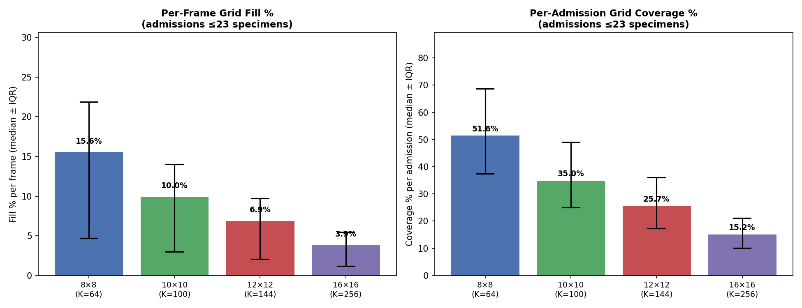

# Subset Analysis: Admissions with ≤23 Specimens

**Date:** February 2026  
**Script:** `scripts/subset_analysis.py --max-specimens 23`  
**Source:** `MIMIC4/lab_events_with_adm.parquet`

---

## 1. Why This Subset?

From the full dataset distribution analysis (see `DATA_ANALYSIS_REPORT.md`), the 75th percentile for specimens per admission is **23**. Admissions with ≤23 specimens represent the majority of the data and align well with VideoMAE's typical input range of 16–32 frames. We analyse this subset to determine the optimal grid size and lab selection for video construction.

---

## 2. Subset Overview

| Metric | Value |
|--------|-------|
| Total admissions in subset | **339,818** (75.9% of 447,689) |
| Median specimens / admission | 9 |
| Mean specimens / admission | 9.6 |
| Range | 1 – 23 |

### Per-Admission Statistics

| Metric | Mean | Median | p5 | p25 | p75 | p95 |
|--------|------|--------|-----|-----|-----|-----|
| Events / admission | 89.2 | 77 | 11 | 41 | 127 | 205 |
| Labs / admission (distinct) | 41.4 | 39 | 10 | 26 | 55 | 78 |
| Specimens / admission (frames) | 9.6 | 9 | 2 | 5 | 14 | 21 |
| Hours / admission (duration) | 52.3 | 39.0 | 0.0 | 13.4 | 75.4 | 143.8 |

The typical admission in this subset lasts ~39 hours (~1.6 days) with 9 frames and 39 distinct lab types.

---

## 3. Grid Size Comparison

We evaluated four candidate grid sizes by selecting the top-K most frequent lab types in this subset and measuring: (a) **per-frame fill %** — what fraction of grid cells have a value in a single specimen, and (b) **per-admission coverage %** — what fraction of grid cells are filled at least once across the entire stay.

| Grid | K (labs) | Frame Fill (median) | Frame Fill (p75) | Adm Coverage (median) | Adm Coverage (p75) |
|------|----------|--------------------:|------------------:|----------------------:|--------------------:|
| 8×8 | 64 | **15.6%** | 21.9% | **51.6%** | 68.8% |
| 10×10 | 100 | 10.0% | 14.0% | 35.0% | 49.0% |
| 12×12 | 144 | 6.9% | 9.7% | 25.7% | 36.1% |
| 16×16 | 256 | 3.9% | 5.5% | 15.2% | 21.1% |



### Recommendation: 8×8 Grid (64 Labs)

The 8×8 grid provides the best density-to-information tradeoff:

- **4× higher frame fill** than 16×16 (15.6% vs 3.9%)
- **Majority coverage per admission** — median 51.6% of grid cells used at least once over the stay
- The top 64 labs cover all clinically essential tests (see Section 4)
- Compatible with VideoMAE patch sizes (e.g., 2×2 or 4×4 spatial patches on an 8×8 grid)

---

## 4. Recommended Lab Selection (Top 64)

The 64 labs are ranked by event count within the ≤23-specimen subset. They group into clinically meaningful categories:

### Core Blood Panel (CBC + BMP) — >89% of admissions

| Rank | itemid | Label | Adm % | Category |
|------|--------|-------|------:|----------|
| 1 | 51221 | Hematocrit | 96.5% | Hematology |
| 2 | 50971 | Potassium | 91.0% | Chemistry |
| 3 | 50912 | Creatinine | 92.5% | Chemistry |
| 4 | 51265 | Platelet Count | 95.1% | Hematology |
| 5 | 51222 | Hemoglobin | 94.6% | Hematology |
| 6 | 50983 | Sodium | 90.5% | Chemistry |
| 7 | 51301 | White Blood Cells | 94.4% | Hematology |
| 8 | 51006 | Urea Nitrogen | 91.2% | Chemistry |
| 9 | 50902 | Chloride | 90.4% | Chemistry |
| 10 | 51249 | MCHC | 94.3% | Hematology |
| 11 | 51250 | MCV | 94.3% | Hematology |
| 12 | 51248 | MCH | 94.3% | Hematology |
| 13 | 51279 | Red Blood Cells | 94.3% | Hematology |
| 14 | 51277 | RDW | 94.3% | Hematology |
| 15 | 50882 | Bicarbonate | 89.7% | Chemistry |
| 16 | 50868 | Anion Gap | 89.7% | Chemistry |
| 17 | 50931 | Glucose | 89.6% | Chemistry |

### Extended Chemistry — ~78–81% of admissions

| Rank | itemid | Label | Adm % | Category |
|------|--------|-------|------:|----------|
| 18 | 50960 | Magnesium | 80.7% | Chemistry |
| 19 | 50893 | Calcium, Total | 79.1% | Chemistry |
| 20 | 50970 | Phosphate | 78.3% | Chemistry |

### Hold / Artifact Codes — Candidates for Removal

| Rank | itemid | Label | Adm % | Category | Notes |
|------|--------|-------|------:|----------|-------|
| 21 | 50934 | H | 37.6% | Chemistry | QC flag, not a lab value |
| 22 | 51678 | L | 37.6% | Chemistry | QC flag, not a lab value |
| 23 | 50947 | I | 37.6% | Chemistry | QC flag, not a lab value |

These three codes (H = Hemolyzed, I = Icteric, L = Lipemic) are **specimen quality flags**, not lab measurements. They should be **excluded** from the grid and replaced with the next-ranked labs.

### RDW-SD

| Rank | itemid | Label | Adm % | Category |
|------|--------|-------|------:|----------|
| 24 | 52172 | RDW-SD | 44.4% | Hematology |

### Coagulation Panel — ~53–56% of admissions

| Rank | itemid | Label | Adm % | Category |
|------|--------|-------|------:|----------|
| 25 | 51237 | INR(PT) | 55.8% | Hematology |
| 26 | 51274 | PT | 55.8% | Hematology |
| 27 | 51275 | PTT | 53.2% | Hematology |

### Liver Function Tests — ~40% of admissions

| Rank | itemid | Label | Adm % | Category |
|------|--------|-------|------:|----------|
| 28 | 50861 | Alanine Aminotransferase (ALT) | 41.5% | Chemistry |
| 29 | 50878 | Asparate Aminotransferase (AST) | 41.3% | Chemistry |
| 30 | 50885 | Bilirubin, Total | 39.8% | Chemistry |
| 31 | 50863 | Alkaline Phosphatase | 39.5% | Chemistry |

### White Cell Differential — ~48% of admissions

| Rank | itemid | Label | Adm % | Category |
|------|--------|-------|------:|----------|
| 32 | 51146 | Basophils | 47.7% | Hematology |
| 33 | 51200 | Eosinophils | 47.7% | Hematology |
| 34 | 51256 | Neutrophils | 47.7% | Hematology |
| 35 | 51254 | Monocytes | 47.7% | Hematology |
| 36 | 51244 | Lymphocytes | 47.7% | Hematology |

### Other Important Labs

| Rank | itemid | Label | Adm % | Category |
|------|--------|-------|------:|----------|
| 37 | 50920 | Estimated GFR (MDRD) | 54.6% | Chemistry |
| 38 | 51003 | Troponin T | 23.9% | Chemistry |
| 39 | 50862 | Albumin | 28.8% | Chemistry |

### Urinalysis Panel — ~35% of admissions

| Rank | itemid | Label | Adm % | Category |
|------|--------|-------|------:|----------|
| 40 | 51514 | Urobilinogen | 35.0% | Hematology |
| 41 | 51478 | Glucose (urine) | 35.0% | Hematology |
| 42 | 51486 | Leukocytes (urine) | 35.0% | Hematology |
| 43 | 51466 | Blood (urine) | 35.0% | Hematology |
| 44 | 51492 | Protein (urine) | 35.0% | Hematology |
| 45 | 51506 | Urine Appearance | 35.0% | Hematology |
| 46 | 51508 | Urine Color | 35.0% | Hematology |
| 47 | 51498 | Specific Gravity | 35.0% | Hematology |
| 48 | 51484 | Ketone (urine) | 35.0% | Hematology |
| 49 | 51487 | Nitrite (urine) | 35.0% | Hematology |
| 50 | 51491 | pH (urine) | 35.0% | Hematology |
| 51 | 51464 | Bilirubin (urine) | 35.0% | Hematology |

### Remaining Labs (ranks 52–67, replacing 3 artifact codes)

| Rank | itemid | Label | Adm % | Category |
|------|--------|-------|------:|----------|
| 52 | 51087 | Length of Urine Collection | 25.5% | Chemistry |
| 53 | 52075 | Absolute Neutrophil Count | 24.1% | Hematology |
| 54 | 52073 | Absolute Eosinophil Count | 24.1% | Hematology |
| 55 | 51133 | Absolute Lymphocyte Count | 24.1% | Hematology |
| 56 | 52069 | Absolute Basophil Count | 24.1% | Hematology |
| 57 | 52074 | Absolute Monocyte Count | 24.1% | Hematology |
| 58 | 50954 | Lactate Dehydrogenase (LD) | 19.1% | Chemistry |
| 59 | 52135 | Immature Granulocytes | 22.4% | Hematology |
| 60 | 50911 | Creatine Kinase, MB Isoenzyme | 16.4% | Chemistry |
| 61 | 50910 | Creatine Kinase (CK) | 16.2% | Chemistry |
| 62 | 50813 | Lactate | 20.0% | Blood Gas |
| 63 | 51516 | WBC (urine) | 24.1% | Hematology |
| 64 | 51476 | Epithelial Cells (urine) | 24.1% | Hematology |
| 65 | 51493 | RBC (urine) | 24.1% | Hematology |
| 66 | 51519 | Yeast (urine) | 24.1% | Hematology |
| 67 | 50933 | Green Top Hold (plasma) | 20.3% | Chemistry |

After removing the 3 artifact codes (H, I, L) and the hold code (Green Top Hold), the final 64 labs are ranks 1–20, 24–62, 63–66 from the table above.

---

## 5. Proposed Final 64-Lab Grid Layout

The 64 selected labs will be arranged in an 8×8 grid, grouped by clinical category for spatial locality:

| Category | Labs | Grid Rows (approx) |
|----------|------|---------------------|
| Hematology (CBC) | Hematocrit, Hemoglobin, WBC, RBC, Platelets, MCV, MCH, MCHC, RDW, RDW-SD | Rows 0–1 |
| WBC Differential + Absolute Counts | Neutrophils, Lymphocytes, Monocytes, Eosinophils, Basophils, Abs Neut, Abs Lymph, Abs Mono, Abs Eos, Abs Baso, Imm Gran | Row 2 |
| Chemistry (BMP) | Sodium, Potassium, Chloride, Bicarbonate, Anion Gap, BUN, Creatinine, Glucose, eGFR | Row 3 |
| Chemistry (extended) | Calcium, Magnesium, Phosphate, Albumin, LDH, CK, CK-MB, Troponin T | Row 4 |
| Liver + Coagulation | ALT, AST, ALP, Bilirubin, INR, PT, PTT | Row 5 |
| Urinalysis | pH, Protein, Glucose, Blood, Ketone, Nitrite, Bilirubin, Specific Gravity, Urobilinogen, Leukocytes, Appearance, Color, WBC, RBC, Epi Cells, Yeast | Rows 6–7 |
| Blood Gas | Lactate | (fill remaining) |

Exact (row, col) → itemid mapping will be generated by the `admission_to_video.py` script and saved for reproducibility.

---

## 6. Next Steps

1. **Implement `admission_to_video.py`** — Time-bin assignment (e.g., 1h bins over first 24h) + build T×8×8 tensors using the 64-lab grid.
2. **Exclude artifact labs** — Remove H, I, L, and hold codes; shift in replacement labs.
3. **Test on a few admissions** — Visually inspect the generated videos to sanity-check fill and values.
4. **Apply admission filters** — e.g., `n_specimens ≥ 4` (removes trivial single-draw admissions).

---

## Appendix: Reproducing This Analysis

```bash
# Default: ≤23 specimens
python scripts/subset_analysis.py

# Custom threshold
python scripts/subset_analysis.py --max-specimens 16

# Custom parquet path
python scripts/subset_analysis.py --parquet MIMIC4/lab_events_with_adm.parquet --max-specimens 23
```
