# Video Construction Report: Temporally-Aligned Admission Videos

**Project:** Latte — VideoMAE-style modeling of ICU lab time series  
**Date:** February 2026  
**Scripts:** `scripts/admission_to_video.py`, `scripts/visualize_videos.py`

---

## Table of Contents

1. [Objective](#1-objective)
2. [Video Construction Method](#2-video-construction-method)
3. [Grid Design: 8×8, 64 Labs](#3-grid-design)
4. [Temporal Alignment: 24h Window, 1h Bins](#4-temporal-alignment)
5. [Specimen-to-Frame Merging](#5-specimen-to-frame-merging)
6. [Sample Video Analysis](#6-sample-video-analysis)
7. [Density Analysis](#7-density-analysis)
8. [The Scale Problem and Normalization](#8-the-scale-problem-and-normalization)
9. [Design Rationale: Why Temporally-Aligned Frames](#9-design-rationale)
10. [Metadata and Reproducibility](#10-metadata-and-reproducibility)
11. [Next Steps](#11-next-steps)

---

## 1. Objective

Convert each hospital admission into a **video tensor** of shape **(T, H, W)** suitable for VideoMAE pre-training, where:

- **T = 24** — number of time bins (1 frame per hour, over the first 24 hours from admission)
- **H × W = 8 × 8 = 64** — spatial grid of lab types (top 64 most frequent labs)
- **Pixel value** = raw lab measurement (float32); NaN = missing/not measured

Each video captures the temporal evolution of a patient's lab profile over the first 24 hours of their hospital stay.

---

## 2. Video Construction Method

### Pipeline Overview

```
For each admission (hadm_id):
  1. Anchor to admittime (t = 0)
  2. Fetch all lab events where charttime ∈ [admittime, admittime + 24h)
  3. Assign each event to an hourly bin: bin = floor((charttime − admittime) / 1h)
  4. For each (bin, lab_type) cell, take the LAST value by charttime
  5. Fill a (24, 8, 8) tensor; NaN for cells with no data
  6. Save as admission_<hadm_id>.npy + structured metadata
```

### Key Design Choices

| Choice | Decision | Rationale |
|--------|----------|-----------|
| Time reference | `admittime` (hospital admission) | Consistent anchor across patients |
| Bin size | 1 hour | Matches eICU benchmark; within typical lab draw frequency |
| Window | First 24 hours | Standard for early prediction tasks; most specimens in this window for acute admissions |
| Aggregation | Last value per (bin, lab) | Most recent measurement is clinically most relevant |
| Grid size | 8×8 = 64 labs | Best density-to-information tradeoff (see `SUBSET_ANALYSIS.md`) |
| Missing value | NaN (float32) | Explicit representation; preserves distinction from zero-valued results |

---

## 3. Grid Design

The 64 lab types are selected from the ≤23-specimen admission subset, excluding artifact/hold codes (H, I, L, specimen type markers, hold tubes). Labs are arranged in the 8×8 grid **sorted by clinical category then itemid**, so related tests occupy contiguous grid regions.

### 3.1 Full Grid Mapping

Every cell in the 8×8 grid is **permanently assigned** to one specific lab type. This mapping is identical for every frame and every admission — position (3, 2) is always Hematocrit, position (2, 3) is always Potassium. The full layout:

| | **col 0** | **col 1** | **col 2** | **col 3** | **col 4** | **col 5** | **col 6** | **col 7** |
|---|---|---|---|---|---|---|---|---|
| **row 0** | Lactate (50813) | ALT (50861) | Albumin (50862) | ALP (50863) | Anion Gap (50868) | AST (50878) | Bicarbonate (50882) | Bilirubin (50885) |
| **row 1** | Calcium (50893) | Chloride (50902) | CK (50910) | CK-MB (50911) | Creatinine (50912) | eGFR (50920) | Glucose (50931) | LDH (50954) |
| **row 2** | Lipase (50956) | Magnesium (50960) | Phosphate (50970) | Potassium (50971) | Sodium (50983) | Troponin T (51003) | BUN (51006) | Abs Lymph (51133) |
| **row 3** | Basophils (51146) | Eosinophils (51200) | Hematocrit (51221) | Hemoglobin (51222) | INR (51237) | Lymphocytes (51244) | MCH (51248) | MCHC (51249) |
| **row 4** | MCV (51250) | Monocytes (51254) | Neutrophils (51256) | Platelet Ct (51265) | PT (51274) | PTT (51275) | RDW (51277) | RBC (51279) |
| **row 5** | WBC (51301) | Bacteria* (51463) | Bilirubin* (51464) | Blood* (51466) | Epi Cells* (51476) | Glucose* (51478) | Ketone* (51484) | Leukocytes* (51486) |
| **row 6** | Nitrite* (51487) | pH* (51491) | Protein* (51492) | RBC* (51493) | Sp Gravity (51498) | Urine Appear (51506) | Urine Color (51508) | Urobilinogen (51514) |
| **row 7** | WBC* (51516) | Yeast* (51519) | Abs Baso (52069) | Abs Eos (52073) | Abs Mono (52074) | Abs Neut (52075) | Imm Gran (52135) | RDW-SD (52172) |

*\* = urinalysis variant. Numbers in parentheses are MIMIC-IV `itemid` values. Full mapping is saved in `lab_videos/grid_layout.json`.*

### 3.2 Clinical Category Grouping

The grid is sorted by d_labitems `category` then `itemid`, which creates natural spatial clusters:

| Grid Region | Category | Clinical Panel | Typical Scales |
|-------------|----------|----------------|---------------|
| Row 0 | Blood Gas + Chemistry | Liver panel (ALT, AST, ALP, Bilirubin) + basics | ALT: 5–50 U/L; Bilirubin: 0.1–1.2 mg/dL |
| Rows 1–2 | Chemistry (extended) | BMP (Na, K, Cl, BUN, Cr, Glucose) + cardiac markers | Na: 135–145; K: 3.5–5.0; Glucose: 70–140; Cr: 0.6–1.2 |
| Rows 3–4 | Hematology (CBC) | CBC (Hct, Hgb, WBC, RBC, Plt) + differential + coag | Hgb: 12–17; WBC: 4–11K; Plt: 150–400K |
| Rows 5–7 | Urinalysis + Absolutes | UA (pH, Protein, Blood) + absolute counts | pH: 5–8; Abs Neut: 1.5–8.0K |

This spatial grouping means that a CBC panel fills a contiguous block in rows 3–5, a BMP fills a block in rows 0–2, and urinalysis fills rows 5–7. The model can learn local spatial patterns within clinical categories — just as a CNN learns that neighboring pixels in a natural image are correlated.

### 3.3 How to Read the Frame Heatmaps

In the sample video figures below, each 8×8 frame is colored using the **viridis** colormap:

| Color | Meaning |
|-------|---------|
| Light gray (#f0f0f0) | **NaN / missing** — this lab was not measured in this hour |
| Dark purple | **Low numeric value** (e.g., Potassium = 4.0, Creatinine = 0.8) |
| Teal / blue-green | **Medium value** (e.g., Sodium = 140) |
| Yellow / bright | **High numeric value** (e.g., Platelet Count = 250,000) |

The color scale is set per-admission by the 1st and 99th percentile of all values in that video. **Important caveat:** because raw lab values span vastly different scales (Potassium ~3–5 vs Platelet Count ~150,000–400,000), high-value labs (Platelets, LDH, CK) dominate the color range and make lower-value labs appear uniformly dark purple. This is the **scale problem**, addressed in [Section 8](#8-the-scale-problem-and-normalization).

---

## 4. Temporal Alignment

Each frame is placed at its **true hourly position** in the 24-hour window. Empty hours remain as NaN frames, preserving the temporal structure.

### Temporal Alignment Across 5 Sample Admissions

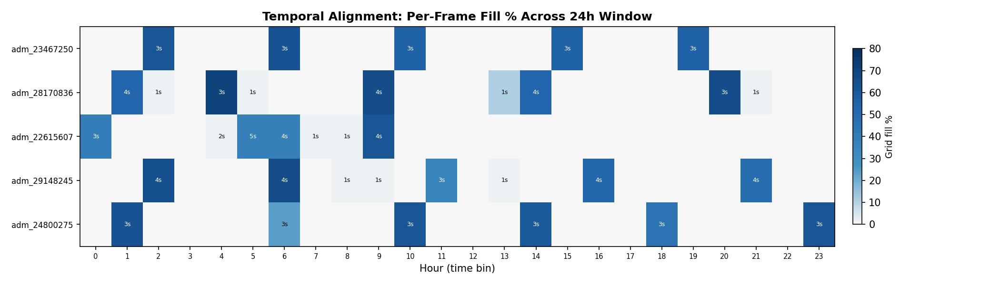

**How to read this figure:** Each row is one admission. Each column is one hour (0–23h from admission). Color intensity = frame fill % (darker = more grid cells filled). The annotation "Ns" = number of specimens merged into that frame. White = empty hour (no labs ordered).

**Key patterns visible:**

- Labs are **not evenly distributed** — they cluster in bursts every 4–6 hours (morning labs, post-procedure labs, etc.).
- Between bursts, most hours are empty — this is the clinical reality.
- Some hours have dense frames (40–45/64 cells = 60–70% fill), while others have just 1 cell (e.g., a standalone Lactate check).
- The temporal gaps themselves are informative: empty hours often correspond to nighttime or stable periods.

---

## 5. Specimen-to-Frame Merging

Multiple specimens often share the same hourly bin because they come from the **same blood draw** (different tubes drawn at the same time). The merging process:

```
Example: Admission 28170836, bin 1 (hour 1–2h)
  specimen 1 (charttime=1.3h): CBC tube → Hct, Hgb, WBC, RBC, MCV, ...
  specimen 2 (charttime=1.3h): BMP tube → Na, K, Cl, BUN, Cr, Glucose, ...
  specimen 3 (charttime=1.6h): Coag tube → INR, PT, PTT
  specimen 4 (charttime=1.6h): LFT tube → ALT, AST, ALP, Bilirubin
  → Merged into 1 frame: 34/64 cells filled (53.1%)
     Time span within bin: 23 minutes
```

This merging is **clinically correct**: the 4 tubes are part of the same lab order and should be viewed as a single snapshot of the patient's state. No information is lost — values from different tubes fill different grid cells (recall that `n_labs/specimen == n_events/specimen`, so no duplicate lab types within a specimen).

### Merge Statistics (5 sample videos)

| Admission | Total Specimens | Merged Into Frames | Avg Specimens/Frame |
|-----------|----------------|--------------------|---------------------|
| 23467250 | 15 | 5 frames | 3.0 |
| 28170836 | 22 | 9 frames | 2.4 |
| 22615607 | 20 | 7 frames | 2.9 |
| 29148245 | 22 | 8 frames | 2.8 |
| 24800275 | 18 | 6 frames | 3.0 |

On average, ~3 specimens are merged into each hourly frame.

---

## 6. Sample Video Analysis

### Admission 28170836

**Raw values** (viridis — yellow = high absolute value, purple = low):

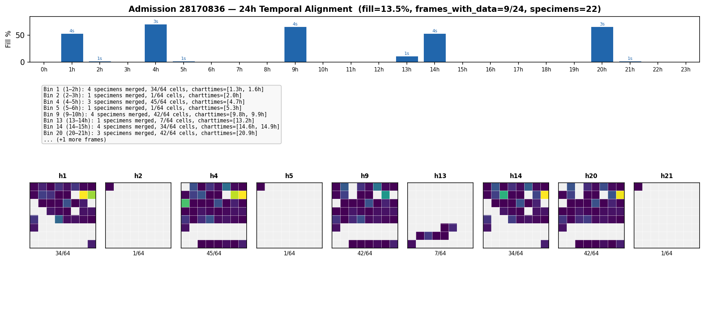

**Normalized z-scores** (RdBu — red = above mean, white = normal, blue = below mean):

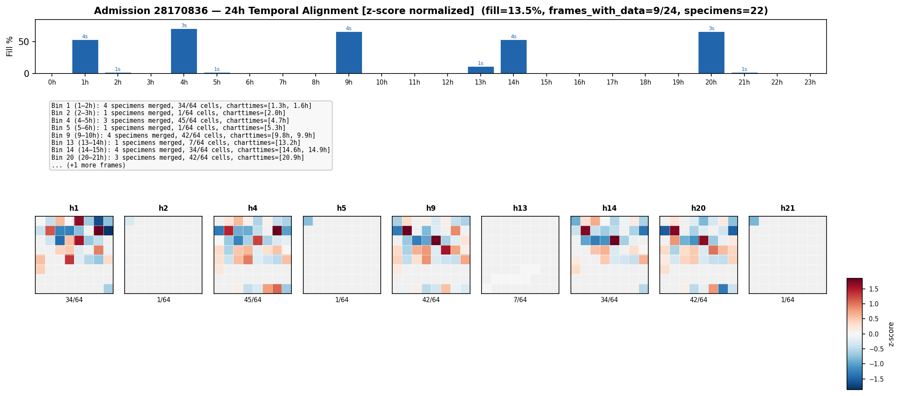

**Interpretation:**
- **9 out of 24 frames** contain data (37.5% temporal density)
- **Overall fill: 13.5%** (207/1536 total cells across the video)
- Lab rounds at hours 1, 4, 9, 14, 20 — each with 34–45/64 cells (53–70% fill)
- Interspersed standalone Lactate checks at hours 2, 5, 21 (1/64 cells)
- Urinalysis at hour 13 (7 cells: pH, Protein, Glucose, Blood, Epi Cells, Sp Gravity, WBC)
- **Clinical story:** ICU patient with frequent monitoring — full panels every ~5h, Lactate tracked every 2–3h (suggests hemodynamic instability or sepsis management)
- **Raw vs normalized:** In the raw view, Platelet Count (row 4, col 3) dominates as bright yellow while all other labs appear dark purple. In the normalized view, each lab's color reflects its own abnormality — low Hemoglobin appears blue, elevated Lactate appears red, and normal-range values appear white. This is the scale problem solved.

### Admission 23467250

**Raw values:**

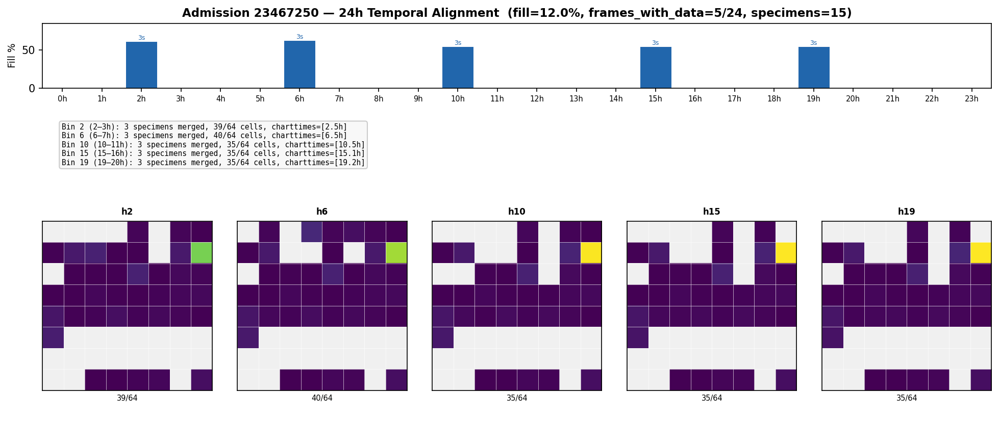

**Normalized z-scores:**

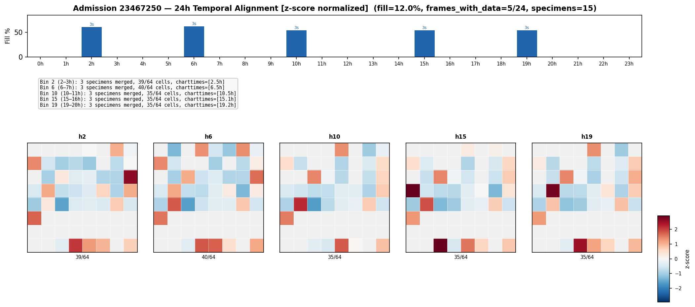

**Interpretation:**
- **5 out of 24 frames** contain data (20.8% temporal density)
- Lab rounds at hours 2, 6, 10, 15, 19 — very regular ~4h spacing
- Each round: 35–40/64 cells (55–63% fill)
- No standalone checks between rounds
- **Clinical story:** Stable ICU patient with routine q4h lab draws

### Admission 22615607

**Raw values:**

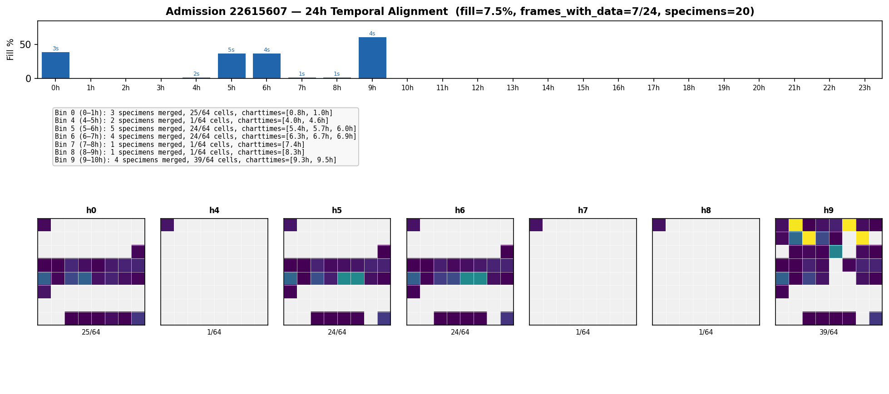

**Normalized z-scores:**

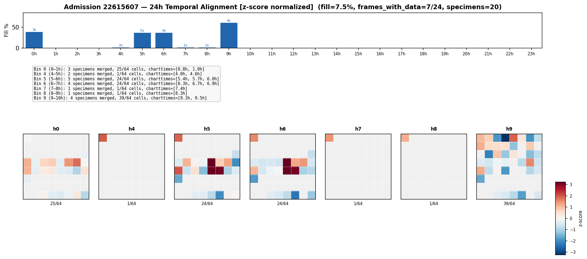

**Interpretation:**
- **7 out of 24 frames** with data, but concentrated in hours 0–10 (nothing after hour 10)
- Most intense monitoring in hours 0–7 (admission workup + early management)
- Frequent Lactate checks (hours 4, 7, 8 — just 1 cell each)
- Dense round at hour 9 (39/64 cells)
- **Clinical story:** Active resuscitation / early admission with frequent Lactate monitoring, then possibly transferred to lower acuity care (labs stop)

### Admission 29148245

**Raw values:**

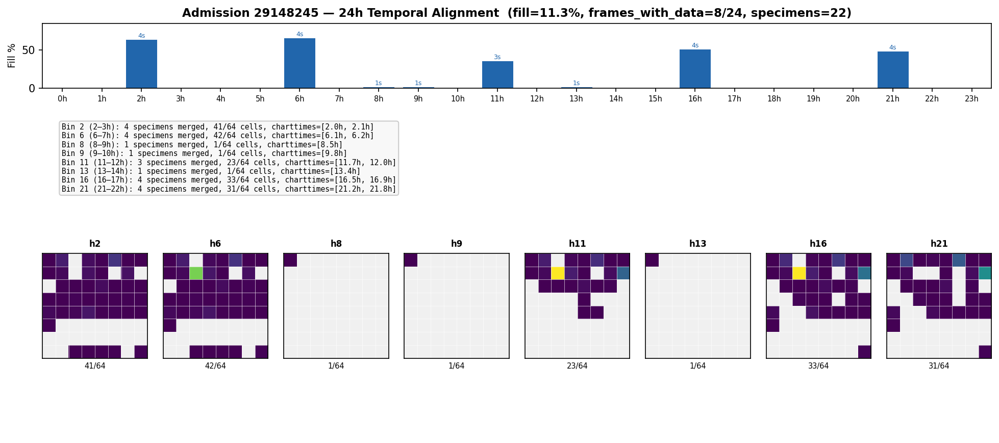

**Normalized z-scores:**

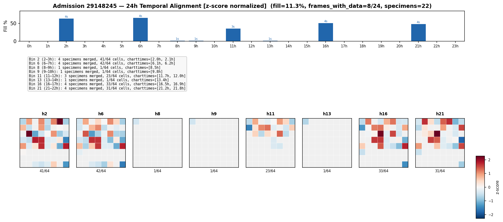

**Interpretation:**
- **8 frames** spanning the full 24h
- Dense panels at hours 2, 6, 11, 16, 21 (23–42/64 cells)
- Lactate checks between panels at hours 8, 9, 13
- **Clinical story:** ICU patient with ~5h lab cycles and intermittent Lactate monitoring

### Admission 24800275

**Raw values:**

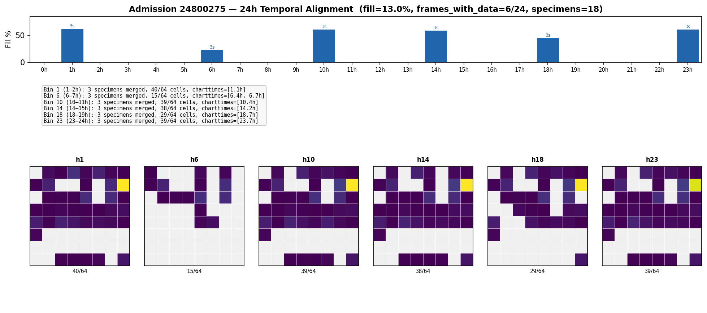

**Normalized z-scores:**

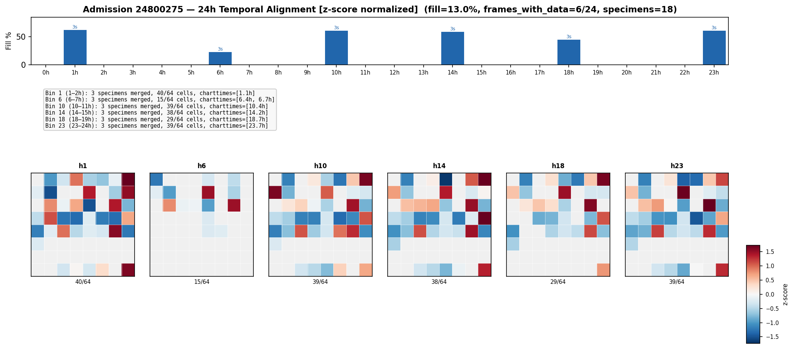

**Interpretation:**
- **6 frames** distributed across 24h (hours 1, 6, 10, 14, 18, 23)
- Dense panels: 29–40/64 cells (45–63% fill)
- Lighter panel at hour 6 (15/64 = 23% — only basic chem + Lactate)
- **Clinical story:** Relatively regular q4–5h labs, with one lighter interim check

---

## 7. Density Analysis

### Aggregate Density Across Sample Videos

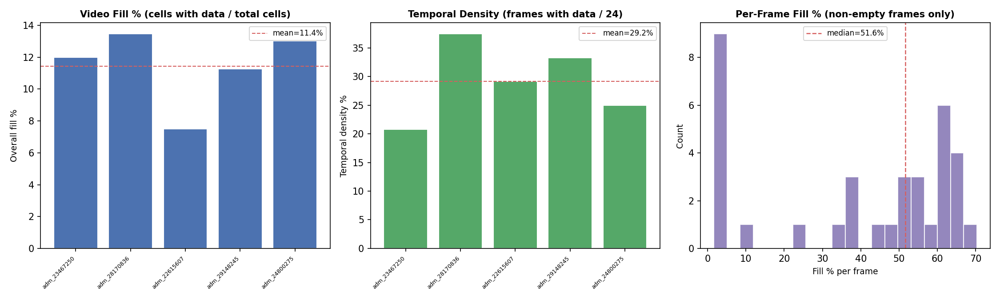

### Summary Statistics

| Metric | Mean | Median | Range |
|--------|------|--------|-------|
| Overall fill % (cells with data / 1536 total) | 11.4% | 12.0% | 7.5% – 13.5% |
| Temporal density (frames with data / 24) | 29.2% | 29.2% | 20.8% – 37.5% |
| Frames with data | 7.0 | 7 | 5 – 9 |
| Per-frame fill % (non-empty frames only) | — | ~53% | 1.6% – 70.3% |
| Specimens merged per video | 19.4 | 20 | 15 – 22 |

### Two Types of Sparsity

1. **Temporal sparsity:** ~71% of hourly bins are empty (no labs that hour). This reflects clinical practice — labs are ordered in rounds, not continuously.

2. **Spatial sparsity within frames:** Non-empty frames fill ~53% of the 64-cell grid on average. This is a major improvement over the original 256-cell grid (which had ~4% fill per frame). The 8×8 grid was chosen precisely to maximize this per-frame density.

### What the Model Sees

For a typical video in this subset:
- **~7 out of 24 frames** have data (the rest are all-NaN)
- Each data frame fills **~34 out of 64 cells** (~53%)
- The total "information content" is 7 × 34 ≈ **238 real values** out of 1,536 total cells (15.5%)

---

## 8. The Scale Problem and Normalization

### 8.1 The Problem: Heterogeneous Feature Scales

Lab values occupy wildly different numeric ranges because they measure fundamentally different biological quantities in different units:

| Lab | Typical Range | Units | Order of Magnitude | Distribution Shape |
|-----|--------------|-------|-------------------|--------------------|
| Potassium | 3.5 – 5.0 | mEq/L | 10⁰ | Approximately Gaussian |
| Creatinine | 0.6 – 1.2 | mg/dL | 10⁰ | Right-skewed (renal failure → 10+) |
| Hemoglobin | 12 – 17 | g/dL | 10¹ | Approximately Gaussian |
| Sodium | 135 – 145 | mEq/L | 10² | Approximately Gaussian |
| Glucose | 70 – 140 | mg/dL | 10² | Right-skewed (DKA → 500+) |
| LDH | 100 – 250 | U/L | 10² | Heavily right-skewed |
| Creatine Kinase | 30 – 200 | U/L | 10² | Heavily right-skewed (rhabdo → 100k+) |
| Platelet Count | 150,000 – 400,000 | /µL | 10⁵ | Mild right skew |

When these raw values are placed in the same tensor, a Platelet Count of 250,000 is ~50,000× larger than a Potassium of 4.5. This heterogeneity causes two concrete problems:

**Problem 1 — Gradient domination (training).** In a reconstruction-based objective (e.g., VideoMAE's MSE loss), the gradient contribution of each pixel is proportional to its squared error. A 1% reconstruction error on Platelets (250,000 × 0.01 = 2,500) produces a gradient 250,000× larger than a 1% error on Potassium (4.5 × 0.01 = 0.045). The optimizer will learn to reconstruct Platelets perfectly while ignoring Potassium — even though a Potassium deviation of 0.5 mEq/L is immediately life-threatening, whereas a Platelet swing of 50,000 may be clinically insignificant.

**Problem 2 — Colormap saturation (visualization).** The viridis colormap is stretched across the full range (0 to ~400,000), making all values below ~1,000 appear as identical dark purple — visually indistinguishable. The heatmaps show Platelet cells as bright yellow and everything else as a uniform dark band.

### 8.2 Survey of Normalization Methods in Clinical Time Series

The problem of heterogeneous feature scales in clinical data has been addressed by multiple preprocessing strategies in the literature. We review four major approaches, their theoretical foundations, and key references.

#### Strategy A: Per-Variable Z-Score Standardization

The most widely adopted approach in clinical ML: standardize each lab type independently to zero mean and unit variance using **training-set statistics only**.

**Mathematical formulation.** For lab type $j$ (where $j \in \{1, \ldots, 64\}$ indexes our grid cells):

$$
\hat{x}_{j} = \frac{x_{j} - \mu_{j}}{\sigma_{j}}
$$

where $\mu_j$ and $\sigma_j$ are the empirical mean and standard deviation of all non-NaN values of lab $j$ in the **training set** only. At inference, the same $(\mu_j, \sigma_j)$ pairs are applied without recomputation.

**Properties:**
- The transformed variable has $\mathbb{E}[\hat{x}_j] = 0$ and $\text{Var}[\hat{x}_j] = 1$ on the training distribution
- The mapping is **affine** (linear + shift), so it preserves the ordering and relative distances between values within each lab
- A value at the population mean maps to z = 0; each standard deviation away maps to z = ±1, ±2, etc.

**Key reference.** This is the default normalization in **MIMIC-Extract** (Wang, McDermott et al., 2020), the standard open-source preprocessing pipeline for MIMIC-III clinical time series. MIMIC-Extract applies per-variable z-score normalization after resampling vitals and labs into hourly bins — exactly matching our pipeline architecture. It is also the default in the **MIMIC-III benchmark suite** (Harutyunyan et al., 2019), the most widely used clinical prediction benchmark, which applies per-variable standardization across 17 clinical variables for mortality, decompensation, length-of-stay, and phenotyping tasks.

| Pros | Cons |
|------|------|
| All variables on the same scale (~0 ± 1) | Assumes roughly symmetric distribution per lab |
| Simple, widely adopted, reproducible | Sensitive to outliers: extreme CK values inflate σ, compressing normal-range variation |
| Preserves relative ordering within each lab | Must store and version 64 (μ, σ) pairs |
| Directly interpretable: z = ±2 ≈ "2 SDs from mean" | |

#### Strategy B: Reference-Range Normalization (Min-Max on Clinical Norms)

Normalize using the clinical reference interval (RI) from MIMIC's `ref_range_lower` and `ref_range_upper` fields:

$$
\hat{x}_{j} = \frac{x_{j} - \text{RI}_{\text{low},j}}{\text{RI}_{\text{high},j} - \text{RI}_{\text{low},j}}
$$

A value of 0.0 = at the lower reference limit; 1.0 = at the upper limit; >1.0 = above normal; <0.0 = below normal.

**Key reference.** The **zlog transformation** (Hoffmann et al., 2017) formalizes this concept: it maps lab results into a universal standardized space using logarithmic reference intervals, producing values with a standard reference interval of [−1.96, +1.96] regardless of the analyte. The zlog approach was developed for Germany's E-Health Law to enable cross-laboratory comparability.

| Pros | Cons |
|------|------|
| Clinically interpretable: 0–1 = normal | ~40% of MIMIC-IV lab rows have null ref ranges |
| Deviations from normal are explicit | Ref ranges vary by sex, age, lab — MIMIC provides only one range |
| No training-set statistics needed | Unbounded output: CK = 10,000 → $\hat{x}$ = 50+ |
| Used by zlog (Hoffmann et al., 2017) | Requires imputation strategy for missing ref ranges |

#### Strategy C: Robust Scaling (Median / IQR)

Replace mean/std with median and interquartile range (IQR) to reduce sensitivity to extreme outliers:

$$
\hat{x}_{j} = \frac{x_{j} - \text{median}_{j}}{\text{IQR}_{j}}
$$

where $\text{IQR}_j = Q_{75,j} - Q_{25,j}$. Alternatively, a full **quantile transform** maps each lab's empirical CDF to a uniform or Gaussian target distribution.

**Key reference.** **FIDDLE** (Tang et al., 2020), a flexible data-driven preprocessing pipeline for structured EHR data published in JAMIA, implements systematic per-variable scaling with built-in outlier handling. Validated on MIMIC-III and eICU across mortality, respiratory failure, and shock prediction tasks (AUROC 0.757–0.886), demonstrating that robust preprocessing matches task-specific baselines.

| Pros | Cons |
|------|------|
| Robust to extreme outliers | IQR can be zero or near-zero for low-variability labs |
| Handles heavily skewed distributions | Quantile transform destroys the original distribution shape |
| No Gaussianity assumption | Must store per-lab median + IQR (or full quantile function) |

#### Strategy D: Variance-Stabilizing Transform + Z-Score

For labs with extreme right skew, apply a **variance-stabilizing transformation** before z-scoring. The most common choice is the log1p transform:

$$
\tilde{x}_{j} = \log(1 + x_{j}), \quad \hat{x}_{j} = \frac{\tilde{x}_{j} - \mu_{\tilde{j}}}{\sigma_{\tilde{j}}}
$$

where $\mu_{\tilde{j}}$ and $\sigma_{\tilde{j}}$ are the mean and standard deviation of the log-transformed values in the training set.

**Scientific rationale.** Many biological analytes follow approximately **log-normal distributions**: the logarithm of the concentration is normally distributed. This is well-established in clinical chemistry (Hoffmann et al., 2017) and arises because:

1. **Multiplicative biological processes.** Enzyme release (CK, LDH, AST) and cell production (WBC, Platelets) involve cascading multiplicative steps. By the central limit theorem applied to products, the resulting distribution is log-normal.
2. **Strictly positive quantities.** Lab values are concentrations or counts, bounded below by zero. The Gaussian assumption allows negative values, which are physically impossible; the log-normal naturally respects this constraint.
3. **Variance-mean relationship.** For raw lab data, the variance typically increases with the mean (heteroscedasticity). The log transform **stabilizes the variance**, making it approximately constant across the range — a prerequisite for z-score normalization to be meaningful.

The more general **Box-Cox transformation** family $y^{(\lambda)} = (y^\lambda - 1)/\lambda$ (Box & Cox, 1964) includes log as the special case λ = 0. Recent work (Alshqaq et al., 2022) shows Box-Cox outperforms simple log for some clinical distributions, but log1p is preferred in practice for its simplicity, interpretability, and established use in clinical benchmarks.

**Key reference.** The **MIMIC-III benchmark** (Harutyunyan et al., 2019) applies log transforms to selected skewed variables before per-variable standardization. The **MIMIC-IV pipeline** (Gupta et al., 2022) extends this to the updated dataset with per-variable normalization and log transforms for selected labs.

| Pros | Cons |
|------|------|
| Stabilizes variance for skewed labs | Only appropriate for positive, right-skewed variables |
| Post-log distribution closer to Gaussian → z-score is valid | Requires per-lab decision: which labs get log-transformed? |
| Compresses extreme range while preserving ordering | Adds one step to the pipeline |
| Standard in critical care ML | |

#### Strategy E: Learned Adaptive Normalization

Recent work proposes **end-to-end learnable normalization** as part of the neural network:

- **Reversible Instance Normalization (RevIN)** (Kim et al., 2022): removes and restores instance-level mean/variance in a symmetric encoder-decoder architecture, handling non-stationary distribution shifts.
- **Extended Deep Adaptive Input Normalization (EDAIN)** (September et al., 2024): learns normalization parameters (shift, scale, power transform) via backpropagation, handling multi-modality, skewness, and outliers better than fixed schemes.
- **UnitNorm** (2024): scales input vectors by their norms and modulates attention patterns in Transformers, addressing token shift and sparse attention problems specific to time series.

These are promising for future work but require architectural integration with the VideoMAE backbone. For Phase 1, we use the established offline normalization pipeline.

### 8.3 Our Approach: Hybrid Per-Lab Normalization

For the Latte pipeline, we implement a **two-step hybrid** strategy that combines variance stabilization with standardization:

#### Step 1 — Selective Log1p Transform

Apply $\tilde{x}_j = \log(1 + x_j)$ to labs with known heavy right skew. The 12 labs selected for log-transform are:

| Grid Position | Lab | Itemid | Rationale for Log Transform |
|--------------|-----|--------|-----------------------------|
| (0,1) | ALT | 50861 | Liver enzyme, right-skewed; hepatitis → 1000+ (normal ~30) |
| (0,3) | ALP | 50863 | Liver/bone enzyme, right-skewed; cholestasis → 500+ (normal ~80) |
| (0,5) | AST | 50878 | Liver enzyme, right-skewed; hepatitis → 1000+ (normal ~25) |
| (0,7) | Bilirubin | 50885 | Right-skewed; liver failure → 20+ (normal ~0.8) |
| (1,2) | CK | 50910 | Heavily right-skewed; rhabdomyolysis → 100,000+ (normal ~100) |
| (1,3) | CK-MB | 50911 | Cardiac enzyme, right-skewed; MI → 100+ (normal ~5) |
| (1,7) | LDH | 50954 | Tissue damage marker, right-skewed; hemolysis → 2000+ (normal ~200) |
| (2,0) | Lipase | 50956 | Pancreatic enzyme, right-skewed; pancreatitis → 1000+ (normal ~30) |
| (2,5) | Troponin T | 51003 | Cardiac biomarker, extreme right skew; MI → 10+ (normal <0.01) |
| (4,3) | Platelet Count | 51265 | Count data, moderate right skew; range 5k–1M+ |
| (5,0) | WBC | 51301 | Count data, right-skewed; leukemia → 100k+ (normal ~7k) |
| (7,2)–(7,5) | Absolute Counts | 52069–52075 | Count data, right-skewed |

Labs **not** log-transformed (approximately Gaussian or symmetric): Potassium, Sodium, Chloride, Calcium, Hemoglobin, Hematocrit, MCV, MCH, MCHC, RDW, pH, Specific Gravity, and most differential percentages (Basophils, Eosinophils, Lymphocytes, Monocytes, Neutrophils).

#### Step 2 — Per-Lab Z-Score Standardization

For each of the 64 grid positions $j$, compute training-set statistics on the (possibly log-transformed) values:

$$
\mu_j = \frac{1}{N_j} \sum_{i=1}^{N_j} \tilde{x}_{i,j}, \quad \sigma_j = \sqrt{\frac{1}{N_j - 1} \sum_{i=1}^{N_j} (\tilde{x}_{i,j} - \mu_j)^2}
$$

where $N_j$ is the count of non-NaN training values for lab $j$, and $\tilde{x}_{i,j}$ is the (possibly log-transformed) value.

Then normalize every value in every video:

$$
\hat{x}_{j} = \frac{\tilde{x}_{j} - \mu_j}{\sigma_j}
$$

NaN values remain NaN — they are not imputed or changed.

#### Step 3 — Post-Normalization Clipping

Clip the z-scores to a safe range to prevent data-entry errors or extreme physiological outliers from destabilizing training:

$$
\hat{x}_{j}^{\text{final}} = \text{clip}(\hat{x}_{j}, -10, +10)
$$

The ±10 bound is deliberately wide. For context:
- A z-score of ±3 corresponds to the 99.7th percentile of a Gaussian — already very abnormal
- A z-score of ±5 is a ~1 in 3.5 million event under Gaussianity
- Clinical extremes (e.g., CK in rhabdomyolysis) typically map to z = ±4 to ±8
- Values beyond ±10 are almost certainly data errors, unit conversion artifacts, or truly unprecedented

#### Complete Pipeline Summary

```
For each lab j in {1, ..., 64}:
  If j ∈ LOG_LABS:
      x̃ = log(1 + x)        ← variance-stabilizing transform
  Else:
      x̃ = x                  ← no transform needed

  ẑ = (x̃ − μ_j) / σ_j       ← per-lab z-score (training-set stats)

  z_final = clip(ẑ, −10, +10) ← safety clipping

NaN → NaN at every step (missingness is preserved, never imputed)
```

**Output tensor:** $(T, H, W) = (24, 8, 8)$ of float32 values, where each pixel represents "how many standard deviations this lab value is from the training population mean, in the (possibly log-transformed) space."

### 8.4 Why Extreme Values Are Preserved (and Amplified)

A natural concern — especially from clinicians — is: *"Does normalization flatten out the extreme values that matter most?"* The answer is **no**. The hybrid log + z-score pipeline makes extreme values **more visible**, not less.

#### Clinical importance of extremes

In ICU medicine, the most actionable lab results are the outliers. Clinicians scan a lab panel looking for values that are "far from normal" — these drive triage, intervention, and escalation decisions:

| Extreme Value | Clinical Meaning |
|---------------|-----------------|
| Potassium = 2.0 mEq/L (normal ~4.5) | Life-threatening hypokalemia — cardiac arrest risk |
| Platelets = 50,000 /µL (normal ~250k) | Thrombocytopenia — possible DIC, HIT, or marrow failure |
| CK = 10,000 U/L (normal ~100) | Rhabdomyolysis — acute renal injury imminent |
| Troponin T = 1.5 ng/mL (normal <0.01) | Acute myocardial injury — immediate catheterization |
| Lactate = 8.0 mmol/L (normal ~1.0) | Severe tissue hypoperfusion / septic shock |

Any preprocessing that blunts these extremes would destroy the most important signal in the data. Our pipeline does the opposite.

#### How log + z-score preserves extremes: CK walkthrough

Consider Creatine Kinase (CK), a lab with extreme right skew (normal ~100, pathological up to 100,000+):

| CK raw | Clinical meaning | log₁p(CK) | Δ from normal (log) | Z-score (approx.) |
|--------|-----------------|-----------|---------------------|-------------------|
| 100 | Normal | 4.62 | 0 | 0 |
| 500 | Mild elevation | 6.22 | +1.60 | +1.2 |
| 1,000 | Moderate elevation | 6.91 | +2.29 | +2.0 |
| 5,000 | Severe (rhabdo likely) | 8.52 | +3.90 | +4.5 |
| 10,000 | Extreme (rhabdo confirmed) | 9.21 | +4.59 | +6.8 |

**What log does.** Compresses the raw 100× distance (100 → 10,000) into a 4.59 log-unit distance. This is a **variance-stabilizing transformation**: it makes the spread of values around CK = 100 comparable to the spread around CK = 10,000. Without it, a CK measurement error of ±50 around CK = 100 and around CK = 10,000 would have the same absolute size but very different clinical significance. After log, both are proportional deviations.

**What z-score does.** Converts the log-space value into "how many training-population standard deviations from the mean?" A z-score of +6.8 is unmistakably extreme — it will be the brightest pixel in any heatmap, and will produce the largest gradient signal during training.

**Why not skip log and just z-score raw CK?** Without log, a raw z-score of CK = 10,000 would be astronomically high (z ≈ 50+). This causes: (1) gradient explosion during training, (2) numerical instability in softmax/attention layers, and (3) no additional clinical information — z = 50 is no more meaningful than z = 7, since both are unambiguously extreme. Log compression keeps the z-score in a useful range (~±10) while preserving the ordering and relative severity of all clinical levels.

#### Extreme value preservation across all lab types

| Example | Raw Value | Transform | Z-score | Signal? |
|---------|-----------|-----------|---------|---------|
| K⁺ = 2.0 mEq/L (low) | 2.0 | None (Gaussian lab) | z = −5.0 | Severe hypokalemia, 5σ below mean |
| Plt = 50k /µL (low) | 50,000 | log₁p → 10.82 | z = −4.2 | Thrombocytopenia clearly stands out |
| CK = 10,000 U/L (high) | 10,000 | log₁p → 9.21 | z = +6.8 | Rhabdomyolysis, very strong signal |
| TnT = 1.5 ng/mL (high) | 1.5 | log₁p → 0.92 | z = +8.5 | Massive MI, highest z in the frame |
| Na⁺ = 160 mEq/L (high) | 160 | None (Gaussian lab) | z = +3.8 | Severe hypernatremia, clearly abnormal |

In every case, clinically dangerous values map to |z| > 3, making them **the most prominent pixels** in the video tensor.

#### Summary for clinicians

> *"Normalization does not divide by a constant and flatten everything. It re-expresses each lab value as 'how abnormal is this, relative to this lab's own population distribution.' Extreme values become high |z-scores| — they are the brightest pixels in the heatmap and the strongest signals for the model. A Potassium of 2.0 becomes z = −5 (screaming bright), a CK of 10,000 becomes z = +6.8 (also screaming bright) — even though their raw values differ by 5,000×. The clinical meaning is not just preserved; it is amplified and made comparable across labs."*

---

### 8.5 Impact on Visualization

With per-lab normalization, the frame heatmaps become **much more informative**:

| | Before (raw values) | After (per-lab z-score) |
|---|---|---|
| Colormap | Viridis (sequential: purple → yellow) | RdBu (diverging: blue → white → red) |
| Color meaning | Absolute magnitude (dominated by Platelets) | How abnormal each lab is relative to its own distribution |
| Dark purple / Blue | Low absolute value (could be normal K⁺ or low Plt) | Below population mean (possibly abnormally low) |
| Yellow / Red | High absolute value (always Platelets or LDH) | Above population mean (possibly abnormally high) |
| Green/teal / White (z ≈ 0) | Mid-range absolute value | Near the population mean — normal |
| Visual contrast | Poor — most labs are indistinguishable dark purple | Good — each lab's color reflects its own clinical range |
| Clinical utility | Cannot distinguish normal K⁺ from dangerously low K⁺ | z = −5 (bright blue) vs z = 0 (white) — immediately visible |

### Z-Score Distribution Across All Videos

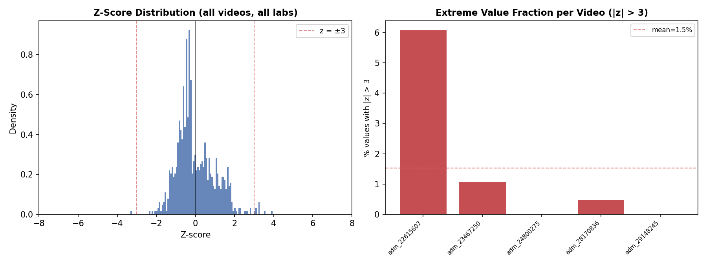

**Left panel:** Histogram of all z-scores across all 5 sample videos. The distribution is centered at 0 (by construction) and most values fall within ±3. The dashed red lines mark z = ±3 — values beyond these are clinically noteworthy outliers.

**Right panel:** Fraction of extreme values (|z| > 3) per video. This quantifies how many "clinically abnormal" measurements each admission contains — a useful metric for characterizing patient acuity.

See [Section 6](#6-sample-video-analysis) for side-by-side raw vs normalized heatmaps of each sample admission.

### 8.6 Implementation Specification

The normalization step sits **between** video construction and model training as a separate, reproducible script:

```
Raw lab videos                    Normalized lab videos
admission_to_video.py      →     normalize_videos.py          →    VideoMAE DataLoader
(24, 8, 8) raw float32           (24, 8, 8) float32, z-scored
NaN = missing                     NaN = missing (unchanged)
                                  + norm_stats.json (μ, σ per lab)
```

**`normalize_videos.py`** will:
1. **Compute training-set statistics:** Scan all training-set `.npy` files, apply log1p to the 12 designated labs, compute $(\mu_j, \sigma_j)$ for each of the 64 grid positions, save to `norm_stats.json`.
2. **Normalize all videos:** For each `.npy` file (train, val, test), apply the same log1p + z-score + clip(±10) pipeline using the training-set statistics.
3. **Save normalized videos:** Write to a parallel directory (e.g., `lab_videos_normalized/`) to preserve raw originals.

**Key design principle:** Raw videos are the immutable ground truth. Normalization is a deterministic, versioned transformation. This allows switching normalization strategies (e.g., robust scaling, quantile transform) without rebuilding videos from the database.

### 8.7 References

1. **Wang, S., McDermott, M.B.A., Chauhan, G., et al.** (2020). "MIMIC-Extract: A Data Extraction, Preprocessing, and Representation Pipeline for MIMIC-III." *Proceedings of ACM CHIL 2020.* — Standard MIMIC-III preprocessing pipeline; applies per-variable z-score normalization after hourly resampling. [GitHub: MLforHealth/MIMIC_Extract](https://github.com/MLforHealth/MIMIC_Extract)

2. **Harutyunyan, H., Khachatrian, H., Kale, D.C., Ver Steeg, G., & Galstyan, A.** (2019). "Multitask Learning and Benchmarking with Clinical Time Series Data." *Nature Scientific Data, 6*, 96. — Benchmark suite for MIMIC-III with four clinical prediction tasks; applies per-variable standardization with log transforms for skewed variables. [GitHub: YerevaNN/mimic3-benchmarks](https://github.com/YerevaNN/mimic3-benchmarks)

3. **Tang, S., Davarmanesh, P., Song, Y., Koutra, D., Sjoding, M.W., & Wiens, J.** (2020). "Democratizing EHR Analyses with FIDDLE: A Flexible Data-Driven Preprocessing Pipeline for Structured Clinical Data." *JAMIA, 27*(12), 1921–1934. — Data-driven EHR preprocessing with systematic per-variable scaling and outlier handling; validated on MIMIC-III and eICU (AUROC 0.757–0.886). [GitHub: MLD3/FIDDLE](https://github.com/MLD3/FIDDLE)

4. **Gupta, A., Rawat, B.P.S., et al.** (2022). "An Extensive Data Processing Pipeline for MIMIC-IV." *Proceedings of ML4H @ NeurIPS 2022.* — Updated MIMIC-IV preprocessing pipeline; per-variable normalization with selective log transforms for skewed laboratory variables.

5. **Che, Z., Purushotham, S., Cho, K., Sontag, D., & Liu, Y.** (2018). "Recurrent Neural Networks for Multivariate Time Series with Missing Values." *Scientific Reports, 8*, 6085. — GRU-D model for irregular clinical time series; per-variable mean standardization; introduces "informative missingness" — the pattern of which labs are ordered carries predictive signal independent of values.

6. **Hoffmann, G., Klawonn, F., Lichtinghagen, R., & Orth, M.** (2017). "The zlog Value as a Basis for the Standardization of Laboratory Results." *LaboratoriumsMedizin, 41*(1), 23–32. — Proposes the zlog transformation for universal standardization of lab results using logarithmic reference intervals; output has a standard reference interval of [−1.96, +1.96].

7. **Box, G.E.P. & Cox, D.R.** (1964). "An Analysis of Transformations." *Journal of the Royal Statistical Society, Series B, 26*(2), 211–252. — Foundational work on variance-stabilizing power transformations; the log transform (λ = 0) is a special case of the Box-Cox family.

8. **Alshqaq, S.S., Elsayed, A.H., & Ahmadini, A.A.H.** (2022). "Preferring Box-Cox Transformation, Instead of Log Transformation, to Convert Skewed Distribution of Outcomes to Normal in Medical Research." *Journal of Radiation Research and Applied Sciences, 15*(4), 100440. — Demonstrates Box-Cox superiority over raw log for some clinical distributions; supports the principle of variance stabilization before standardization.

9. **Informatics BMJ** (2021). "Varying Association of Laboratory Values with Reference Ranges and Outcomes in Critically Ill Patients: An Analysis of Data from Five Databases in Four Countries." *BMJ Health & Care Informatics, 28*(1), e100419. — Multi-center study across 330+ ICUs showing standard reference ranges are inadequate for ICU patients; supports population-based (z-score) over reference-range normalization in critical care settings.

10. **September, I., et al.** (2024). "Extended Deep Adaptive Input Normalization for Preprocessing Time Series Data for Neural Networks." *Proceedings of AISTATS 2024.* — Learnable normalization layer (EDAIN) that adapts shift, scale, and power transform parameters via backpropagation; future direction for end-to-end normalization in the Latte pipeline.

11. **Li, Z., et al.** (2024). "Standardization with Zlog Values Improves Exploratory Data Analysis and Machine Learning for Laboratory Data." *LaboratoriumsMedizin.* — Demonstrates zlog outperforms standard z-score for laboratory data preprocessing across clustering, dimension reduction, and classification tasks.

---

## 9. Design Rationale: Why Temporally-Aligned Frames

We considered several alternative approaches (see brainstorming notes in conversation). Here is why temporally-aligned fixed bins were chosen:

### Alternatives Considered

| Approach | Frame Density | Temporal Info | Complexity | Issue |
|----------|:------------:|:------------:|:----------:|-------|
| **Fixed 1h bins (chosen)** | ~53% per data frame | Preserved in position | Low | Empty frames |
| Sequential (frame 0,1,2...) | ~53% per frame | Lost | Low | Only 3–5 real frames; too short for VideoMAE |
| Forward fill (LOCF) | 100% | Preserved | Low | Creates fake data; stale ≠ fresh |
| Adaptive quantile bins | Balanced | Destroyed | Medium | Frame semantics differ across patients |
| Coarser bins (4h) | Higher | Partial | Low | T=6 too short |

### Why Temporally-Aligned Wins

1. **No information loss:** Every real lab value is preserved at its correct temporal position. Empty bins accurately represent "no labs this hour" — itself a clinically meaningful signal (stable patient, nighttime, etc.).

2. **Cross-patient comparability:** "Frame 5" always means "hour 5–6 from admission" for every patient. The model can learn that certain lab patterns at hour 6 predict outcomes differently than the same values at hour 20.

3. **Specimen merging is lossless:** Multiple tubes from the same blood draw naturally merge into one frame (they fall in the same hourly bin). Since no lab type repeats within a specimen, there are no collisions — the merged frame is a more complete snapshot than any individual tube.

4. **Compatible with VideoMAE:** Fixed shape (24, 8, 8) for all videos. No variable-length handling needed. The sparsity (71% empty frames, ~53% fill on data frames) is within the range that masked autoencoders can handle — VideoMAE already masks 90–95% of input patches.

---

## 10. Metadata and Reproducibility

Each run of the pipeline produces:

| Output | Path | Content |
|--------|------|---------|
| Raw video tensors | `lab_videos/admission_<hadm_id>.npy` | float32, shape (24, 8, 8), raw lab values |
| Grid layout | `lab_videos/grid_layout.json` | (row, col) → itemid, label, category |
| Video metadata | `lab_videos/video_metadata.json` | Per-frame: specimen IDs, charttimes, fill %, labs present |
| Normalized videos | `lab_videos_normalized/admission_<hadm_id>.npy` | float32, shape (24, 8, 8), z-scored values |
| Normalization stats | `lab_videos_normalized/norm_stats.json` | Per-lab μ, σ, log flag, sample count |

### Metadata Structure (per admission)

```json
{
  "hadm_id": 28170836,
  "video_shape": [24, 8, 8],
  "window_hours": 24.0,
  "bin_hours": 1,
  "video_summary": {
    "fill_pct": 13.48,
    "frames_with_data": 9,
    "frames_empty": 15,
    "temporal_density_pct": 37.5,
    "total_specimens_merged": 22,
    "specimen_ids": [...]
  },
  "frames": [
    {
      "bin": 1,
      "hour_range": "1–2h",
      "n_cells_filled": 34,
      "fill_pct": 53.1,
      "n_specimens_merged": 4,
      "specimen_ids": [12345, 12346, 12347, 12348],
      "charttimes_hours": [1.3, 1.6],
      "time_span_minutes": 23.0,
      "labs_present": [
        {"itemid": 50813, "label": "Lactate"},
        {"itemid": 50861, "label": "ALT"},
        ...
      ]
    },
    ...
  ]
}
```

This metadata enables full traceability: from any pixel in the video back to the original specimen, charttime, and lab value.

### Reproducing This Report

```bash
# Step 1: Build raw videos for the top 5 richest admissions
python scripts/admission_to_video.py --max-specimens 23 --min-specimens 4 --top 5

# Step 2: Normalize (log1p + z-score + clip)
python scripts/normalize_videos.py

# Step 3a: Visualize raw videos
python scripts/visualize_videos.py

# Step 3b: Visualize normalized videos (diverging colormap)
python scripts/visualize_videos.py --video-dir lab_videos_normalized --normalized

# For larger batches
python scripts/admission_to_video.py --max-specimens 23 --min-specimens 4 --top 1000
python scripts/normalize_videos.py
```

---

## 11. Next Steps

| Step | Description | Priority |
|------|-------------|----------|
| **Scale up** | Run `admission_to_video.py` on all qualifying admissions (cloud VM recommended for full dataset) | High |
| ~~**Normalization**~~ | **Done** — `normalize_videos.py` implements log1p + z-score + clip (see [Section 8](#8-the-scale-problem-and-normalization)) | Done |
| **Observation mask** | Generate a binary mask array (24, 8, 8) alongside each video: 1 = observed, 0 = missing | High |
| **Train/val/test split** | Split by `subject_id` (not `hadm_id`) to prevent data leakage | High |
| **VideoMAE adaptation** | Adapt masking strategy for inherent sparsity; consider masking only non-NaN patches | Medium |
| **Alternative time schemes** | Test 2h bins (T=12) or 48h window (T=24 with 2h bins) as comparative experiments | Medium |
| **Forward-fill variant** | Build LOCF version as a comparison experiment (carry last value forward + staleness channel) | Low |

---

## Appendix: Scripts Reference

| Script | Purpose |
|--------|---------|
| `scripts/admission_to_video.py` | Main pipeline: admission → raw (T, H, W) .npy + metadata |
| `scripts/normalize_videos.py` | Normalization: log1p + z-score + clip → normalized .npy + norm_stats.json |
| `scripts/visualize_videos.py` | Generate heatmaps, timelines, density plots (supports `--normalized` flag) |
| `scripts/admission_stats.py` | Dataset-level distribution statistics |
| `scripts/admission_plots.py` | Distribution plot generation |
| `scripts/subset_analysis.py` | Grid size comparison and lab selection analysis |
| `scripts/top_admissions.py` | Rank admissions by lab event count |
